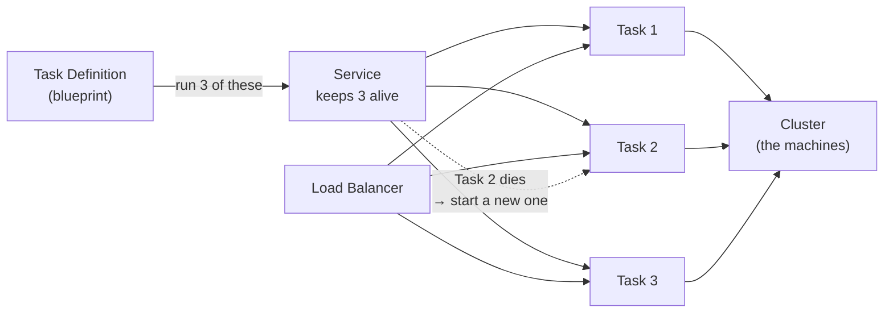
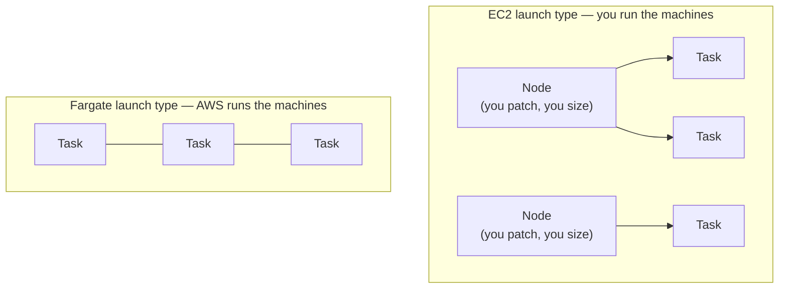
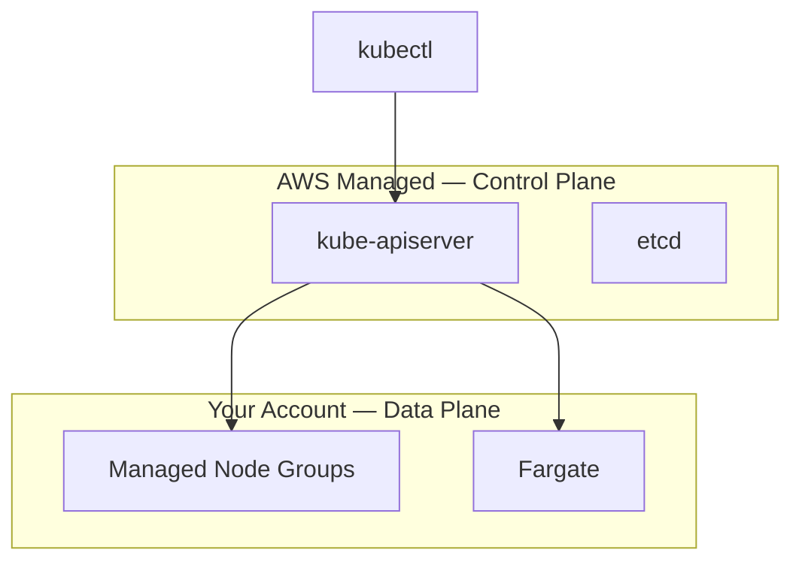
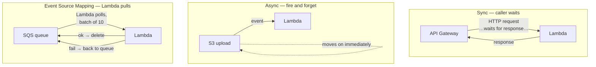
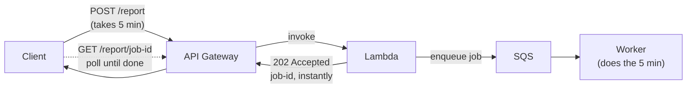

# Containers & Serverless — ECS, EKS, Lambda, API Gateway

## ECS — Elastic Container Service

### Mental model

- **Task Definition** — blueprint: image, CPU/memory, ports, env vars, IAM role, volumes.
- **Task** — a running instance of the definition.
- **Service** — maintains desired task count, integrates with LBs, replaces failures.
- **Cluster** — the compute they run on.



Read it as: the blueprint says *what* to run, the service says *how many*, the cluster is *where*. Task 2 dies → the service notices and starts a replacement. That self-healing is the service's whole job.

### Launch types: EC2 vs Fargate

**Launch type = whose machines your containers run on.** The container itself is identical either way — same image, same definition. The only thing it decides: when the task runs, is the hardware underneath yours or Amazon's?

- **EC2 launch type** — *your* machines. Your EC2 instances, your patching, your sizing; ECS just places containers on them. Cheaper at scale, more control.
- **Fargate launch type** — *Amazon's* machines. You hand ECS a container and say "run this"; compute appears, runs it, disappears. You never see a server. More expensive per compute unit, zero machine ops.



### The two IAM roles (consistently confused)

- **EC2 Instance Profile** — attached to the *node*; used by the **ECS Agent** (register with control plane, pull definitions, ship logs).
- **ECS Task Role** — in the task definition; assumed by the **application in the container** (S3 reads, DynamoDB writes).

Attaching app permissions to the Instance Profile "works" but gives *every* task on the node that access — least privilege means Task Roles.

```
EC2 Node
  └── Instance Profile (ECS Agent perms)
Container (Task)
  └── Task Role (application perms)
```

### Deployment strategies

- **Rolling** — replace old tasks in batches (`minimumHealthyPercent` / `maximumPercent`). Risk: some traffic hits a broken version before rollback.
- **Blue/Green (CodeDeploy)** — new version runs alongside old; traffic shifted all-at-once, canary, or linear; automatic rollback to blue on failed health checks. Safer for production.

Blue/Green is the **setup**: old and new both running, side by side. Canary/linear/all-at-once are the **shift speed** — how fast you move traffic from old to new within that setup:

```
Blue/Green setup (both running):
                    ┌─ Blue (v1) ◄── traffic
  users ──► LB ─────┤
                    └─ Green (v2) ◄── waiting

Shift speed choices:
  all-at-once:  blue 100% → green 100%          (instant flip)
  canary:       blue 95% / green 5% → 25% → 100% (ramp, small blast radius)
  linear:       blue 90% / green 10% → 20% → 100% (even steps over an hour)
```

They're often mixed up because "canary deploy" is also a name for the whole approach — the difference is just whether the second environment exists (blue/green always has one; canary-only doesn't need a full idle copy).

### ECS auto scaling

Service Auto Scaling adjusts **desired task count** (Target Tracking / Step / Scheduled; metrics like `ECSServiceAverageCPUUtilization`, ALB `RequestCountPerTarget`).

Critical: **task scaling ≠ instance scaling**. Tasks scale up but nodes are full → tasks stuck PENDING. EC2 launch type needs both ECS Service Auto Scaling and cluster capacity scaling. Fargate removes the problem.

## EKS — Elastic Kubernetes Service

### Control plane vs data plane (always asked)

- **Control plane** (AWS-managed): API server, scheduler, controller manager, etcd (the cluster's state database) — replicated across AZs, ~$0.10/hr. You never see these nodes.
- **Data plane** (you manage): worker nodes — EC2 node groups or Fargate.



### Node types

- **Managed Node Groups** — EKS provisions and lifecycle-manages EC2 nodes (AMI updates, drain before terminate). Most common.
- **Self-Managed Nodes** — you manage AMIs/patching; for configs managed groups don't support.
- **Fargate** — each pod in isolated compute. **No DaemonSets** (no nodes), no local-storage stateful workloads. Bursty/stateless only.

### AWS Load Balancer Controller

Watches Kubernetes Ingress resources and **provisions an ALB** — translates Ingress paths into ALB listener rules and target groups. The standard way to expose EKS services.

### EKS node autoscaling

EKS does **not** scale nodes automatically — pods go Pending until you scale manually or run the **Cluster Autoscaler** (or Karpenter). "EKS scales automatically" is the classic wrong answer: the control plane is managed, node scaling is not.

### ECS vs EKS

| | ECS | EKS |
|---|---|---|
| Complexity | Low, AWS-native | High, full K8s curve |
| Portability | AWS-only | Runs anywhere K8s runs |
| Ecosystem | AWS integrations | Vast CNCF (Prometheus, Istio, Argo) |
| Use when | AWS-only, simpler workloads | Multi-cloud, K8s expertise, service mesh |

## Lambda

### Invocation models (the most important Lambda concept)

| | Sync | Async | Event Source Mapping |
|---|---|---|---|
| Callers | API Gateway, ALB, SDK | S3 events, SNS, EventBridge | Lambda polls SQS/Kinesis/DynamoDB Streams |
| Behaviour | Caller waits for response | Fire-and-forget | Batches delivered to function |
| Retries | **None** — caller retries | Auto: 2 retries w/ backoff → DLQ/Destination | SQS: batch returns to queue; Kinesis: **retries same batch until success — a bad record blocks the whole shard** |



Three shapes, one service. Sync: someone's waiting on the other end. Async: event fired, nobody waits. Event source mapping: **Lambda is the puller** — the queue does nothing but sit there, and Lambda decides when to come take messages.

### Cold starts

No warm environment → provision compute, init runtime, run init code: 100ms–1s extra. Worse with: big packages, Java, (historically) VPC.

**The correct programming model**: everything outside the handler runs once per cold start and is reused by warm invocations — SDK clients, DB connection pools, config.

```python
import boto3

s3_client = boto3.client('s3')          # runs ONCE per cold start
db = create_db_connection()             # expensive — outside handler

def handler(event, context):            # runs per invocation
    return s3_client.get_object(Bucket='my-bucket', Key=event['key'])
```

**Provisioned Concurrency** — pre-initialised environments, always warm; pay continuously. For latency-sensitive user-facing functions.

### Lambda in a VPC

Default Lambda can't reach VPC resources. Configure VPC/subnets/SG → Lambda creates ENIs. The historical ENI-per-cold-start penalty was fixed in 2019 (shared, pre-created ENIs) — still asked to test you know the evolution.

**VPC Lambda + internet**: private subnet without a NAT Gateway = no internet, same as EC2. "Works locally, times out in production" → check VPC/subnet/NAT.

### Lambda + SQS event source mapping

Lambda polls, batches, invokes; deletes on success, returns to queue on failure.

```yaml
BatchSize: 10
MaximumBatchingWindowInSeconds: 5
FunctionResponseTypes:
  - ReportBatchItemFailures    # only FAILED messages return to queue
```

`ReportBatchItemFailures` matters: without it, 1 failed message in a batch of 10 retries all 10 — 9 processed twice.

### Concurrency

Account-wide pool (default 1,000). One function can starve the rest → set **Reserved Concurrency** on critical functions.

## API Gateway

### What it does

Managed front door: routing, auth (IAM, Cognito, Lambda authorizers), rate limiting/usage plans, SSL termination, request/response transformation, monitoring. Standard entry point for Lambda APIs (ALB and function URLs lack built-in auth/throttling).

### Integrations

- **Lambda Proxy** — full HTTP request as a structured event; most common.
- **HTTP** — managed reverse proxy to ALB/EC2/any HTTP endpoint.
- **AWS Service** — call AWS directly, no Lambda: `POST /orders` → SQS enqueue.

### API Gateway vs ALB

| | API Gateway | ALB |
|---|---|---|
| Auth | Built-in (IAM, Cognito, authorizers) | None built-in |
| Rate limiting | Usage plans, per-client throttling | None |
| Request transform | Yes | No |
| Cost | Per request | Per hour + LCU |
| Latency overhead | ~10–50ms | Minimal |

**Cost trap**: per-request pricing gets expensive at volume — break-even vs ALB ≈ 700M requests/month.

**Hard timeout**: 29 seconds — API Gateway 504s even though Lambda allows 15 minutes. Long ops → async pattern: enqueue to SQS, return 202, client polls.



The trick: the API call itself returns in milliseconds; the slow work happens behind the queue. The client polls for the result instead of holding the connection open — because API Gateway hangs up at 29 seconds no matter what Lambda is allowed to do.
