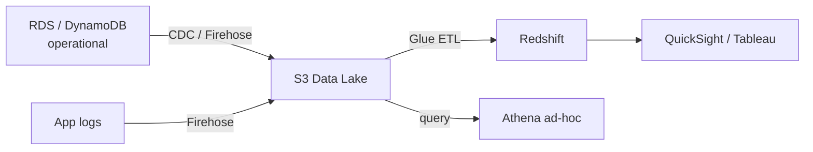

# Choosing the Right Database

Scenario questions — the right answer is never just a name: state the workload characteristics, then the choice, then the reason.

## The scenarios

| Scenario | Choice | Why |
|---|---|---|
| Payments: users, accounts, transactions | **PostgreSQL (RDS/Aurora)** | ACID — debit and credit succeed or fail together; stable schema, well-defined relations |
| Product catalogue, per-item-type attributes (shirt: size; laptop: RAM) | **DynamoDB** | Schemaless items, key lookups, unpredictable scale, ms reads. Nullable-column or EAV SQL tables are the anti-pattern |
| Sessions / query cache, sub-ms latency | **ElastiCache Redis** | Ephemeral KV, TTL, atomic ops, pub/sub |
| Product search: fuzzy match, ranking, facets | **OpenSearch** | Full-text search engine. Keep the source of truth in RDS/DynamoDB; sync via Streams/CDC — it's a **rebuildable secondary index** |
| BI: complex SQL over 3 years of orders | **Redshift** | Columnar warehouse for analytics — never run analytics on the operational DB; ETL (Glue/Firehose) loads it |
| Query logs in S3, no infrastructure | **Athena** | Serverless SQL over S3 (Parquet/JSON/CSV); pay per TB scanned → **partition by date/service or bills explode** |

## Athena vs Redshift

| | Athena | Redshift |
|---|---|---|
| Data | Stays in S3 | Loaded into Redshift |
| Management | None | Cluster (or serverless) |
| Latency | Seconds–minutes (data-size bound) | Seconds (with good sort/dist keys) |
| Cost | Per TB scanned | Per hour / per query |
| Best | Ad-hoc, log analysis, data lakes | Repeated BI queries, dashboards |

## The typical analytics pipeline

## Wrong answers to avoid

- **"RDS for everything"** — wrong when schema varies per item, scale is unpredictable, or access is pure key-lookup with no joins.
- **"DynamoDB for everything"** — wrong when you need ad-hoc queries, complex filtering, or multi-item transactions.
- **OpenSearch as the only store** — no replay/rebuild if it corrupts; always keep a primary source of truth.
- **Unpartitioned Athena** — every query scans everything; partition from day one.
