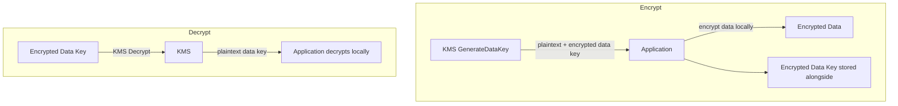
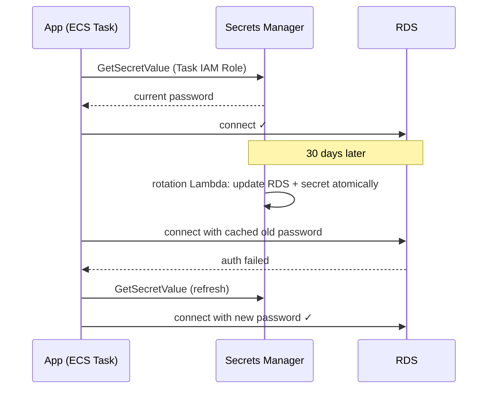

## KMS — Key Management Service

Every AWS encryption service (EBS, S3 SSE-KMS, RDS, Secrets Manager, CloudTrail logs) bottoms out in KMS. It's the foundation of AWS encryption.

### Key types

- **AWS-managed keys** (`aws/s3`, `aws/rds`) — created per service, no policy control, no cross-account, auto-rotate yearly. Default when you tick "encryption" without choosing a key.
- **Customer-managed keys (CMK)** — you control policy, rotation, access; cross-account sharing; every use audited in CloudTrail. $1/key/month + API calls. Use when you need audit trails, cross-account encryption, or instant revocation (disable the key).
- **Custom key stores** — CloudHSM-backed; regulatory only.

### Envelope encryption — the core concept

KMS can't encrypt bulk data (4KB API limit, latency, cost). Instead:

1. KMS `GenerateDataKey` → returns a plaintext **data key** + a copy encrypted by your KMS key.
2. App encrypts data **locally** with the data key; stores encrypted data + encrypted data key; discards the plaintext key.
3. Decrypt: send the encrypted data key to KMS, get plaintext back, decrypt locally.

**KMS never sees your data — only the data key.** Every AWS encryption service works this way under the hood.



### Key policies

Resource-based policy on the key. **IAM alone is not enough** — the key policy must also grant the principal. Mandatory statement: allow the **account root** — without it the key can become permanently unmanageable and AWS support cannot recover it.

```json
{
  "Statement": [
    { "Effect": "Allow",
      "Principal": { "AWS": "arn:aws:iam::123456789012:root" },
      "Action": "kms:*", "Resource": "*" },
    { "Effect": "Allow",
      "Principal": { "AWS": "arn:aws:iam::123456789012:role/app-role" },
      "Action": ["kms:Decrypt", "kms:GenerateDataKey"], "Resource": "*" }
  ]
}
```

### Rotation

AWS-managed keys: yearly, automatic. CMKs: enable annual automatic rotation — new key material for **new** encryptions; old material retained to decrypt old ciphertext; ARN unchanged, no app changes. Rotation does **not** re-encrypt existing data.

### Why SSE-KMS throttles

Every S3 object read/write = a KMS call for the data key. At high rates → KMS quota → `SlowDown` errors. Fix: quota increase or **S3 Bucket Keys** (bucket-level data key, cuts KMS calls by up to 99%).

## Secrets Manager vs SSM Parameter Store

| | SSM Parameter Store | Secrets Manager |
|---|---|---|
| Primary use | Config + secrets | Secrets only |
| Cost | Free (standard) | $0.40/secret/month + API calls |
| Rotation | **Manual — you build it** | **Built-in, automatic via Lambda** (RDS/Redshift/DocumentDB templates) |
| Value size | 4KB (8KB advanced) | 64KB |
| Cross-account | No | Yes (resource policy) |
| Best for | App config, feature flags, non-rotating secrets | DB passwords, API keys, anything needing rotation |

Parameter types: String (plaintext), StringList, **SecureString** (KMS-encrypted — for sensitive values).

## The interview answer: "How does your app get its DB password?"

Password lives in **Secrets Manager** with automatic rotation (e.g. 30 days — a Lambda updates the RDS password and the secret atomically). The app fetches it via its **IAM role** (never hardcoded), caches in memory, and **re-fetches on auth failure** — which signals the secret rotated. Rotation is transparent; no restarts. During rotation both `AWSCURRENT` and `AWSPREVIOUS` are valid because instances may still hold the old password in connection pools.



Anti-patterns: `GetSecretValue` per request (latency + API cost — use the caching client); 200 config params in Secrets Manager ($80/mo — Parameter Store is free); AWS-managed keys for cross-account encryption (need a CMK).
