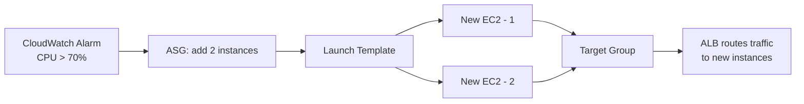

## The three load balancers

Layers = OSI model levels: **Layer 7** sees the application protocol (HTTP paths, headers), **Layer 4** sees only IP + port, **Layer 3** only IPs.

- **ALB (Application LB)** — Layer 7. Reads HTTP headers, paths, query params, host names. Enables path-based routing (`/api/*` → one target group, `/static/*` → another), host-based routing (multi-tenant), header-based routing (canary: 5% where `X-Canary: true`). Handles SSL termination, WebSockets, HTTP/2.
- **NLB (Network LB)** — Layer 4. IP + port only, no protocol parsing → millions of req/s, ultra-low latency, non-HTTP protocols. **Preserves client IP** by default (ALB does not — use `X-Forwarded-For`). Right choice when you need a **static IP** for the LB.
- **GLB (Gateway LB)** — Layer 3. Transparently inserts third-party appliances (firewalls, IDS/IPS) into the traffic path. Not general-purpose.

## Target groups and health checks

A target group collects targets (EC2, IPs, Lambda, other ALBs). Health checks run per target; unhealthy targets leave rotation. Healthy after passing N consecutive checks (healthy threshold), unhealthy after failing N (unhealthy threshold).

## Sticky sessions

Bind a client to one target for a cookie's lifetime. ALB supports application-based (your app sets the cookie) and duration-based (ALB sets it) stickiness. Problem: uneven load — one target with 60% of long-lived sessions takes 60% of load regardless of fleet size. Right answer: stateless apps, sessions in ElastiCache.

## Cross-zone load balancing

Without it, each LB node serves only targets in its own AZ: 2 targets in AZ-A and 8 in AZ-B with 50/50 AZ split → each AZ-A target gets 25% of total traffic, each AZ-B target 6.25%. With cross-zone on, all targets get an equal share.

- ALB: always on, free.
- NLB / GLB: off by default, inter-AZ data transfer charges apply.

## Auto Scaling Groups

ASG keeps a fleet between min and max; **desired capacity** is the current target. **Launch Templates** (not legacy Launch Configurations) define each instance: AMI (the OS image to boot), type, SGs (Security Groups), IAM role, user data, volumes.

Scaling policies:

- **Target tracking** — most common. "Keep average CPU at 40%"; ASG computes adds/removes. Handles scale-out and scale-in.
- **Step scaling** — proportional response: +2 instances at CPU 60–80%, +4 above 80%.
- **Scheduled** — set desired capacity at a set time for predictable patterns (scale up before 9am spike).
- **Cooldown** (default 300s) — pause after a scaling activity so metrics settle; prevents flapping.

