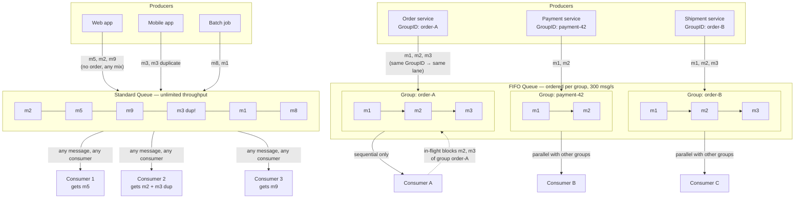
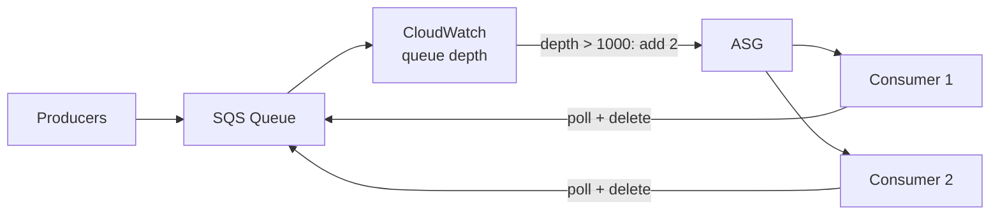
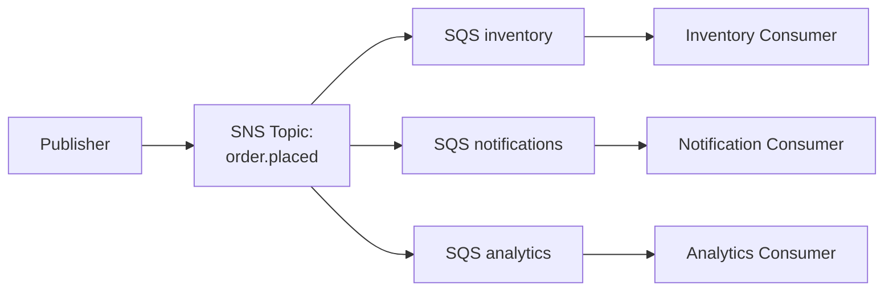
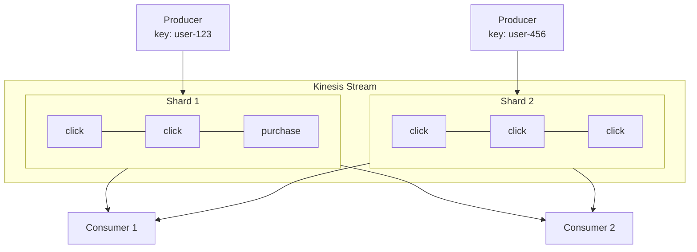
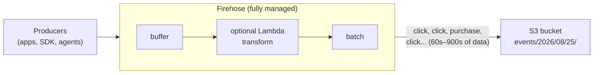
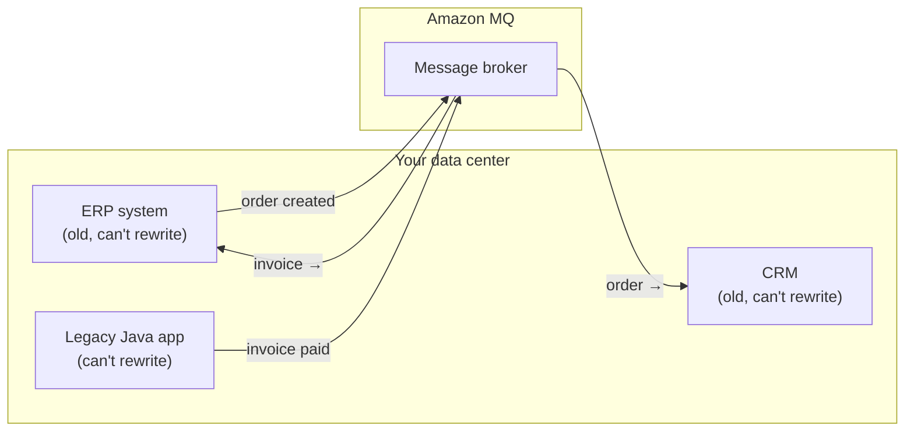

# Messaging — SQS, SNS, Kinesis

## The one idea behind all of it

One app sends a message. Another app receives it. That's it — **publish** = send, **consume** = receive.

```
App A ──"order placed"──► [ middle thing ] ──► App B
        publishes                        consumes
```

Why bother with the middle thing at all? App A doesn't need to know who cares about "order placed", where they live, or whether they're awake. It drops the message and moves on. The middle thing holds it and hands it over when the receiver is ready.

Every service in this note is the same picture with one change: what the middle thing does with the message —
- **SQS**: hand it to one receiver, then throw it away
- **SNS**: give a copy to everyone who asked
- **Kinesis**: let everyone read it, and keep it around so they can read again later
- **Amazon MQ**: whatever your old apps already expect

## SQS — Simple Queue Service

### Mental model

Durable, distributed queue: producer writes → consumer polls, processes, deletes. Until explicit `DeleteMessage`, the message stays. This makes SQS **at-least-once delivery** — duplicates happen, so **consumers must be idempotent** (processing a message twice must produce the same result as once).

- **Standard** — unlimited throughput, no ordering guarantee, possible duplicates.
- **FIFO** — strict ordering within a **message group** (same group ID → ordered, never concurrent); 300 msg/s cap (3,000 batched). Exactly-once via **deduplication ID** (duplicates within 5 min discarded). Use only when ordering genuinely matters.



**How to read it — top half (Standard)**: messages land in a single unordered pool. Any consumer gets any message; the pool may contain **duplicates** (`m3` sent twice → possibly processed twice — hence idempotent consumers) and no ordering (`m5` arrives before `m2`). Throughput is unlimited.

**Bottom half (FIFO)**: each GroupID is an independent ordered lane. Consumer A processing `m1` of `order-A` blocks `m2`/`m3` **of that group only** — meanwhile `payment-42` and `order-B` flow freely to other consumers. Ordering where it matters, parallelism everywhere else. Deduplication IDs silently discard duplicate sends within 5 minutes.

### Visibility timeout — the most important operational detail

On poll, the message isn't deleted — it's made **invisible for the visibility timeout** (default 30s). Consumer must process + delete in that window. Crash or timeout → message becomes visible again, another consumer picks it up.

**Trap**: processing consistently longer than the timeout → duplicate processing. Fix: raise the timeout to match processing time, or call `ChangeMessageVisibility` mid-flight to extend.

### Long vs short polling

Short polling returns immediately (billed even when empty). Long polling waits up to 20s for a message — reduces empty responses, cost, CPU spin. Almost always right: set `WaitTimeSeconds` 1–20.

### Dead Letter Queue (DLQ)

After a message fails processing `maxReceiveCount` times (each visibility-timeout expiry increments the count), SQS moves it to the DLQ automatically.

Without a DLQ, **poison pills** (messages that always fail — malformed payload, bug, dead dependency) loop forever, burning consumer capacity. With one, they're quarantined for inspection, alerting, and replay. DLQ retention should be long (14 days max).

```
Poison pill with DLQ (maxReceiveCount=3):
Queue → Consumer (fails, count=1) → (fails, 2) → (fails, 3)
      → SQS moves message to DLQ → Alert fires → Engineer investigates
```

### SQS + ASG scaling pattern

Scale consumers on **queue depth** (`ApproximateNumberOfMessagesVisible`), not CPU. Queue depth is a **leading indicator** — the fleet grows before consumers are overwhelmed.



## SNS — Simple Notification Service

### Pub/sub model

Producer publishes one message to a **topic**; SNS pushes to all subscribers simultaneously (SQS, Lambda, HTTP, email, SMS). Key difference from SQS: **SQS is pull-based, SNS is push-based**, and SNS does **not persist** — an unavailable subscriber loses the message unless it's an SQS queue (which buffers).

### Fan-out pattern — SNS + SQS

One event → multiple independent downstream systems, each with its own queue and processing rate. Slow analytics service? Its queue backs up; inventory and notifications unaffected. Adding a fourth consumer = new SQS subscriber, zero producer changes.



### Message filtering

Each subscriber defines a **filter policy** (JSON on message attributes); SNS delivers only matching messages. Filtering lives at the **subscription**, not the publisher — one topic with filter policies beats one topic per message type.

```json
{ "order_type": ["physical"] }
```

## Kinesis Data Streams

### When is it actually used?

**SQS is a to-do list. Kinesis is a diary.**

- SQS messages are **tasks** — "process this order." Done once, deleted, worthless afterwards.
- Kinesis records are **facts** — "user clicked X at 14:03." Facts don't get "done." Different teams ask different questions about the same facts, at different times.

Reach for Kinesis when:

1. **Multiple consumers need the same data** — fraud team, dashboard, and warehouse all reading one clickstream. (SQS gives each message to exactly one consumer.)
2. **You want to re-ask questions later** — new ML model? Re-train on last month. Bug in the pipeline? Replay. (SQS deletes history on consume.)
3. **It's a continuous flow, not discrete tasks** — clicks, logs, IoT sensors, trades: events/second, forever. An order to process is a *queue* problem; a firehose of events is a *stream* problem.
4. **Real-time reaction is the product** — fraud alerts within seconds, not hourly batch.

### Core model

Real-time streaming: a **stream** is divided into **shards**; each shard = 1 MB/s write, 2 MB/s read. Producers assign a **partition key**; Kinesis hashes it to pick the shard. Same key → same shard, strictly ordered within the shard.

**Replay is the defining feature SQS lacks**: retention 24h default, up to 365 days. Records can be re-read.



Three ideas:

1. **Same key → same shard** → records with the same key stay ordered.
2. **Shards run in parallel**; each is capped at 1 MB/s in, 2 MB/s out.
3. **All consumers read the same records** — nothing is deleted, so any consumer can rewind and replay (24h–365d retention).

**Replay example**: the warehouse loader writes to S3 via Firehose. At 14:00 the warehouse goes down for an hour; the loader can't write, but **the stream doesn't care** — records keep flowing in and just sit there. At 15:00 the warehouse recovers. The loader rewinds its checkpoint to the 14:00 position and re-reads that hour — no data lost, producers never knew anything happened. With SQS, every message delivered during the outage would have been deleted after processing (or lost in the dead consumer) — there's nothing to go back to.

### Kinesis vs SQS — decision framework

```
                    SQS                         Kinesis Data Streams
─────────────────────────────────────────────────────────────────────
Ordering           No (Standard),               Yes, per shard
                   Yes (FIFO, limited)
Delivery           At-least-once                At-least-once
Consumers          One message, one consumer    Multiple consumers, same data
Replay             No — deleted after consume   Yes — up to 365 days
Throughput         No provisioning              Shard = 1MB/s in, 2MB/s out
Retention          4–14 days                    24h–365 days
Message size       256 KB                       1 MB
Use case           Task queues, async decoupling  Real-time analytics, event
                                               sourcing, log aggregation
```

**Heuristic**: multiple independent consumers reading the same data, or replay needed → Kinesis. Distribute work where each message is done once → SQS.

Scenario test: "clickstream events; data science dashboard + fraud scoring + warehouse load" — three consumers, same data, real-time → **Kinesis**. "Process each order exactly once" → **SQS**.

## Kinesis Data Firehose

Fully managed **delivery pipeline**: ingests a stream, buffers, optionally transforms via Lambda, delivers to S3 / Redshift / OpenSearch / Splunk. No consumers, shards, or checkpoints to manage. Pay per data volume ingested.



Three ideas:

1. **No consumers to build** — you don't read from Firehose; AWS delivers *for* you. Your app just pushes events in.
2. **It buffers and batches** — events arrive continuously, but delivery waits for a buffer window (60s–900s) or size. Latency is minutes, not milliseconds.
3. **Destination is storage** — S3, Redshift, OpenSearch. The data lands *at rest*, ready for SQL/queries — not in a running app.

The batch node in the diagram shows what actually gets delivered: one file containing a chunk of the stream (e.g. all events from a 60s window), written into a dated S3 prefix.

|           | Data Streams                 | Firehose                      |
| --------- | ---------------------------- | ----------------------------- |
| Purpose   | Real-time stream processing  | Delivery to storage/analytics |
| Consumers | You build them (Lambda, KCL) | AWS manages delivery          |
| Latency   | <200ms                       | Buffer interval 60s–900s      |
| Replay    | Yes (365d)                   | No                            |
| Scaling   | Manual / on-demand           | Automatic                     |

Often used together: Streams feed Lambda for real-time AND Firehose for archival.

```
Clickstream → Kinesis Stream ─┬→ Lambda fraud scoring  (real-time, seconds)
                              └→ Firehose → S3          (archival, minutes)
```

## Amazon MQ

Managed version of ActiveMQ / RabbitMQ. Exists for one reason: you have an **old app already built around one of these tools**, and it's moving to AWS. Instead of rewriting the app to use SQS/SNS, point it at Amazon MQ — nothing else changes.



Usage: old systems that already speak a messaging protocol talk to each other through Amazon MQ — the ERP drops "order created" onto it, the CRM picks it up, the legacy app publishes "invoice paid", the ERP consumes it. Nobody rewrites anything; each app just points at Amazon MQ instead of the old server. **You'd never pick this for a new project** — new projects use SQS/SNS.

Three ideas:

1. **Nothing about your app changes** — it keeps using the same messaging tools it always did. You only change the address it connects to: your server → AWS's server.
2. **A server you don't fully control** — AWS runs it, patches it, keeps it alive across failures. But it's still a server somewhere with a size you pick. SQS/SNS have no server at all — you just call an API.
3. **Don't choose it for new apps** — it exists purely as the easy path for old apps. A new app should use SQS/SNS: simpler, cheaper, nothing to run.

The dashed border on Amazon MQ = "there's a server in the middle again." With SQS/SNS that box doesn't exist — apps talk directly to AWS's messaging API and AWS handles everything behind it.

```
Choosing a messaging service:
New app on AWS?                    → SQS (queues) / SNS (pub/sub)
Fan-out to multiple consumers?     → SNS + SQS
Existing JMS/AMQP/MQTT app?        → Amazon MQ (migration path)
Real-time stream processing?       → Kinesis Data Streams
Deliver stream to S3/Redshift?     → Kinesis Firehose
```
