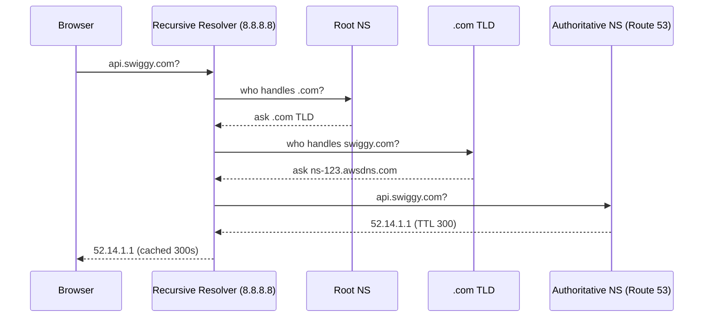
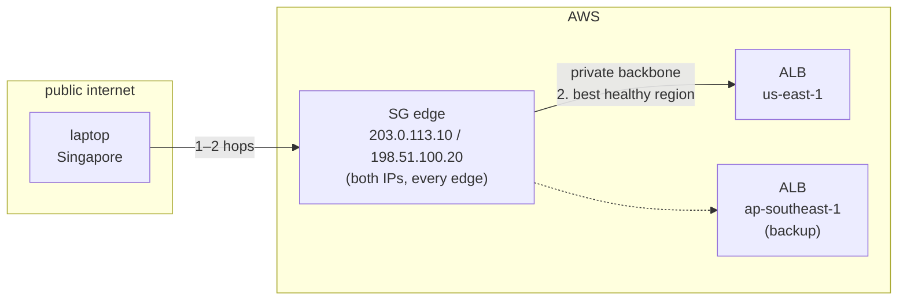

## DNS resolution — how it actually works

`api.swiggy.com` → OS cache (TTL — cache-expiry seconds, see below — still valid? done) → **Recursive Resolver** (`8.8.8.8`) → **Root nameservers** ("who handles .com?") → **TLD servers** ("who handles swiggy.com?") → **Authoritative nameserver** (Route 53 — holds the actual records) → IP cached for TTL.



**Recursive vs authoritative**: the recursive resolver holds no records — it queries and caches. The authoritative server (Route 53) holds them. You can't flush `8.8.8.8`'s cache — only your own resolver, or wait for TTL.

### TTL — the operational lever

TTL = seconds a resolver may cache a record. Change an A record with a 24h TTL → some users hit the old IP for 24h. **SRE practice: drop TTL to 60s, 24–48h before a planned migration; raise it back after.** High TTL = fewer queries/cheaper; low TTL = fast propagation and rollback.

## Route 53

### Record types

A (IPv4), AAAA (IPv6), CNAME (hostname → hostname), NS (zone delegation), MX (mail), TXT (verification, SPF/DKIM).

### CNAME vs Alias (asked constantly)

> **Bare domain** (a.k.a. **zone apex**, root domain, naked domain) — the domain with nothing in front of it: `myapp.com`. Subdomains have a label attached (`api.myapp.com`, `www.myapp.com`) and are NOT bare.

- **CNAME** — a normal DNS record that points a name to *another name* (e.g. `app.myapp.com` → `myapp-loadbalancer.amazonaws.com`). One catch: you can't put it on the bare domain (`myapp.com`)

- **Alias** — Route 53's special record that points directly at an **AWS resource** (ALB, CloudFront, S3 website, API Gateway). Three perks over CNAME:
	1. Works on the bare domain (`myapp.com`) — exactly where CNAME is illegal.
	2. Auto-tracks the resource's changing IPs — no stale-cache risk, no extra DNS lookup.
	3. DNS queries for AWS resources are **free** (normal queries cost $).

	Upside over CNAME, one restriction: it can **only** point at AWS — anything outside AWS needs a CNAME.

```
myapp.com → ALB?      Alias (CNAME at apex is invalid)
api.myapp.com → external hostname?   CNAME (Alias can't leave AWS)
```

### Routing policies

Policy controls **which IP Route 53 returns** — it doesn't route traffic.

| Policy | Behaviour |
|---|---|
| Simple | Return all values, client picks. **No health checks** — returns dead IPs too |
| Weighted | Proportional split (70/30); weight 0 = no traffic. Canary deploys |
| Failover | Primary if healthy, secondary on health-check failure (active-passive) |
| Latency-based | Lowest-latency **region** by measured network latency, not geography |
| Geolocation | By user's country/continent. **Always add a default record** or unmatched users get NXDOMAIN |
| Geoproximity | By distance from regions + a **bias** to grow/shrink a region's catchment. Needs Traffic Flow, pricier |
| Multi-Value | Up to 8 **healthy** IPs; client-side load balancing — not an ALB replacement |

"Shift 20% of European traffic from eu-west-1 to eu-central-1 gradually?" → **Geoproximity with bias**, not Geolocation.

### Health checks

Performed by Route 53's global checkers from multiple locations (healthy = threshold, default 18 of ~200). Can monitor an endpoint, other health checks (calculated), or **a CloudWatch alarm** — routing decisions on any metric. Failover/Multi-Value need an attached health check to detect failure.

## Global Accelerator

The problem: your app lives in one or two regions. Users far away reach it over the **public internet** — slow, unpredictable hops, and if the region dies, DNS failover takes minutes. Public IPs also change when you rebuild infrastructure.

Global Accelerator fixes this: you get **two static IPs that never change** (same IPs from every AWS location — that's what "Anycast" means: one IP announced from many places, users routed to the nearest). Traffic enters AWS at the closest edge location and rides AWS's private backbone to the best regional endpoint (ALB/NLB/EC2/EIP) — public internet skipped. If a region goes unhealthy, traffic shifts in under 30s because the entry IPs stay the same.

Why *two* IPs, if both are announced from every edge (so both are ~equidistant from any user)? Each IP is served by an **independent network zone** — AZ-style isolated infrastructure with its own subnet. If one IP gets blocked or its zone dies, the other keeps working; clients just retry on it. Distance has nothing to do with it — it's fault isolation. ([AWS GA FAQ](https://aws.amazon.com/global-accelerator/faqs/))

### Example: user in Singapore, app in us-east-1

**Setup** — create an accelerator (AWS gives you 2 static IPs), add a listener on port 443, register your ALBs as endpoints (us-east-1 primary, ap-southeast-1 backup), point DNS at the GA IPs. No code change — GA just sits in front of your ALBs.



How to read it:

**1. Laptop → edge (public internet, 1–2 hops).** DNS gives the laptop the GA IP. The laptop just sends packets to it. Every edge location announces that same IP, and the ISP's router picks the shortest route. Since the Singapore edge is 2 hops away and the US edge is 6, Singapore wins. Pure geography — a São Paulo user's nearest edge is São Paulo. Same trick as `8.8.8.8`.

**2. Edge → ALB (AWS private backbone).** The edge *is* the destination — ~100 edges all genuinely own that IP, none is a fake. It terminates the TCP connection itself, then opens a fresh one over the private backbone to the best healthy endpoint. If us-east-1 dies, the edge dials ap-southeast-1 instead — the laptop never notices. That's the <30s failover.

```
leg 1: laptop ←──public internet──→ edge     (TCP ends here)
leg 2: edge ←──private backbone──→ ALB       (fresh connection)
```

The two-leg design also means: laptop's real IP is carried on leg 2 (no X-Forwarded-For), and GA just relays bytes — works for any TCP/UDP, not just HTTP.

**Without GA** for contrast: the laptop would resolve the ALB's IP directly and cross ~10 public-internet hops to us-east-1. The ALB's IP changes when you rebuild, and a region failure means a DNS update plus TTL wait — minutes of outage.

**When things die:**

```
edge dies    → stops announcing → ISP re-routes to next edge (seconds)
one IP dies  → its network zone failed/blocked → client retries on the other static IP
region dies  → edges dial the backup region → <30s
```

### Global Accelerator vs CloudFront

|           | CloudFront               | Global Accelerator                                       |
| --------- | ------------------------ | -------------------------------------------------------- |
| Does      | Caches content at edge   | Routes traffic over AWS backbone                         |
| Caching   | Core feature             | **None**                                                 |
| Protocols | HTTP/HTTPS/WebSocket     | Any TCP/UDP                                              |
| IPs       | Dynamic                  | Static Anycast (firewall-whitelist friendly)             |
| Client IP | Needs X-Forwarded-For    | Preserved natively                                       |
| Failover  | Regional, not built-in   | <30s cross-region                                        |
| Use       | CDN for sites/APIs/video | Gaming (UDP), IoT, VoIP, non-HTTP, multi-region failover |

"Global UDP gaming latency" → Global Accelerator. "Slow static images in SEA" → CloudFront.

Gotchas: GA is **not a CDN** — no caching; the origin still serves every request. Its health checks are endpoint-level (ALB reachable), not application-level (5xx detection) — pair with Route 53 checks or CloudWatch alarms.
