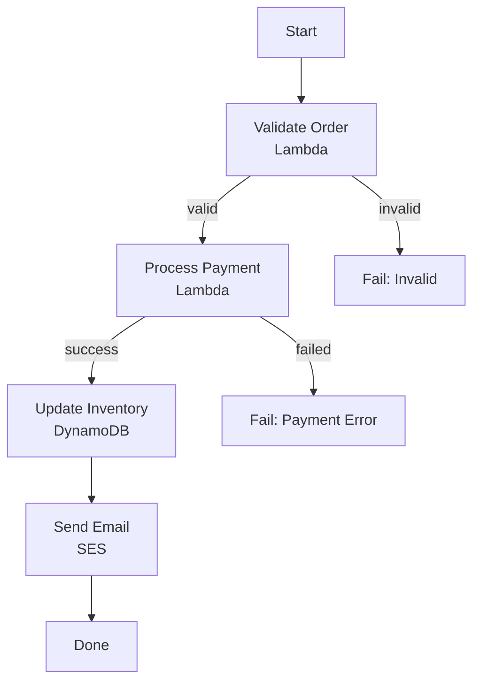
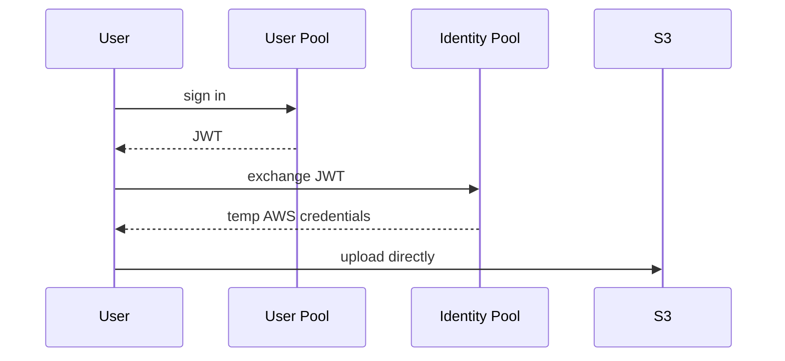

# Step Functions & Cognito

## Step Functions — serverless orchestration

### The problem

Chaining Lambdas (A calls B calls C) creates tight coupling, messy error handling ("step 3 failed after step 2 succeeded — now what?"), invisible workflows, manual retries.

Step Functions replaces it with a managed **state machine**: transitions, retries, parallel branches, error handling — declarative, visual, auditable, resumable from any failed step.

### Standard vs Express

| | Standard | Express |
|---|---|---|
| Max duration | **1 year** | **5 minutes** |
| Execution guarantee | Exactly-once | At-least-once |
| Pricing | Per state transition | Per execution + duration |
| Use | Long business processes, approvals | High-frequency short workflows (thousands/sec) |

Cost trap both ways: Standard for high-frequency short executions = very expensive; Express for long processes = history isn't durable + 5-min cap.

**Not a message queue**: it orchestrates a fixed sequence for one execution. "Process 10,000 orders in parallel" → SQS + consumers, not Step Functions.

## Cognito

### User Pools vs Identity Pools (the single most asked Cognito question)

- **User Pool** — managed user directory: sign-up/sign-in, passwords, MFA, federation (Google/Facebook/SAML). Output: **JWT** (ID + access token). Answers: *who is this user?*
- **Identity Pool** — exchanges any identity token (User Pool, Google, OIDC) for **temporary AWS credentials** via STS. Answers: *what AWS resources can this user touch directly?*

Common architecture — both together: User Pool authenticates → JWT → Identity Pool exchanges it for STS credentials scoped to an IAM role → the client calls S3/DynamoDB **directly** from browser/app.

### Cognito + API Gateway

Simpler pattern for web APIs: User Pool issues JWT → frontend sends `Authorization: Bearer <token>` → **API Gateway validates against the User Pool natively** — no Lambda authorizer, no backend auth code. Standard serverless auth.

Gotcha: access tokens expire (default 1h). Refresh-token logic is **the app's job** — without it, users get silent 401s after an hour.
