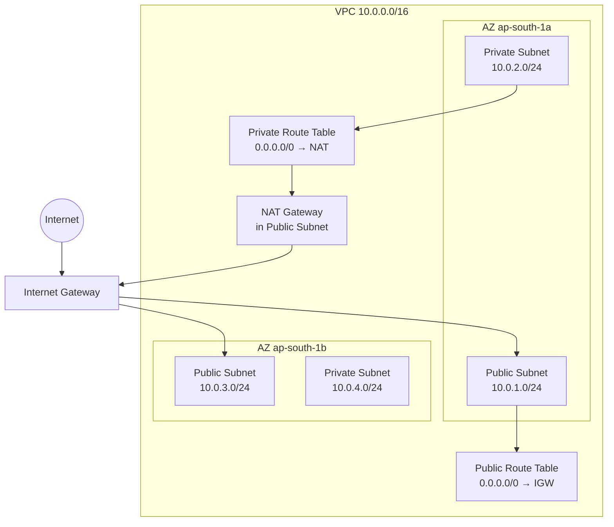

# VPC & Networking

## Why VPC exists

Before VPC, all AWS resources shared a flat network — any EC2 could reach any other. A **VPC** (Virtual Private Cloud) is your isolated network inside AWS where you control the IP range, subnets, routing, and connectivity. Your own private data centre inside AWS.

## Building blocks

**CIDR** defines the IP range. `10.0.0.0/16` = 65,536 addresses, sliced into subnets.

**Subnets** are subdivisions of a VPC, each pinned to one **AZ (Availability Zone)** — a physically separate data centre within a region. `10.0.1.0/24` = 256 addresses (AWS reserves 5 → 251 usable). Public/private is **not** a property of the subnet — it comes from what's connected to it:

- **Public subnet** — has a route to an Internet Gateway (IGW); resources can hold public IPs.
- **Private subnet** — no route to the IGW; not reachable directly from the internet. Databases and sensitive services live here.



## Internet Gateway vs NAT Gateway

**IGW (Internet Gateway)** — attached to the VPC, enables bidirectional internet connectivity. For a resource in a public subnet to reach the internet, **all three** must be true: it has a public IP, the subnet's route table routes `0.0.0.0/0` to the IGW, and the **Security Group** (the instance-level firewall — section below) allows the traffic.

**NAT Gateway** — lives in a public subnet; lets private-subnet resources **initiate outbound** connections (patches, external APIs) without being reachable from the internet. One-directional: translates private IP → NAT's public IP for outbound and maps responses back; unsolicited inbound is dropped. Costs per hour + per GB processed — a real operational cost at scale.

## Route tables

A **route table** is attached to each subnet: a list of rules saying "packets going to destination X are sent to target Y." **Most specific rule wins**; the `local` rule (the VPC's own IP range) always exists and can't be removed.

```
Incoming packet — user hits 54.123.45.67 (instance's public IP):
1. IGW rewrites it to the private IP: 10.0.1.50
2. Route table: 10.0.1.50 is inside 10.0.0.0/16 → local → delivered

Outgoing packet — instance calls 142.250.x.x (external server):
1. Route table: 142.250.x.x matches 0.0.0.0/0 → send to IGW
2. IGW rewrites the source to the public IP → out to the internet

(The reply from the server is just another incoming packet — step 1 again.)
```

## Security Groups vs NACLs

One of the most reliably asked SRE comparison questions.

|            | Security Group                             | NACL                                           |
| ---------- | ------------------------------------------ | ---------------------------------------------- |
| Level      | Instance                                   | Subnet                                         |
| State      | **Stateful** (return traffic auto-allowed) | **Stateless** (in/out evaluated independently) |
| Rules      | Allow only                                 | Allow **and** Deny                             |
| Evaluation | All rules                                  | By rule number, lowest wins                    |

SG stateful means: allow inbound 443 → response goes out automatically. NACL stateless means: allow inbound 443 → you must also allow outbound **ephemeral ports 1024–65535** (the random high ports the client OS picks for the *response* side of a connection) or the connection fails coz you allowed only 443.

**Rule fields — SG**: protocol, port range, source/destination.
**Rule fields — NACL**: same protocol/port/CIDR fields, plus two NACL-only ones:


Practice: SGs are the primary control. NACLs are the last line of defence for blocking a known bad IP with an explicit Deny.

## VPC endpoints

The story: your EC2 (private subnet) wants to talk to S3. S3 lives on the public internet, so by default the traffic goes out through the NAT Gateway — and NAT charges per GB. You're paying Amazon to talk to Amazon. Dumb.

**VPC endpoint** = a shortcut that lets your instance talk to AWS services without leaving AWS's private network. Two flavours:

- **Interface endpoint** — Amazon puts a little network card (ENI) with a private IP inside your subnet. Your instance talks to that IP instead of going through NAT; Amazon carries the traffic to the service over its own internal network. Works with almost every AWS service (SQS, CloudWatch, Secrets Manager, ECR…). Costs money per hour + per GB.
- **Gateway endpoint** — no network card. Just one extra line in your route table: "traffic going to S3 goes through this door instead of the NAT." Only S3 and DynamoDB. **Free.**

Remember: **Gateway = free, but only S3 + DynamoDB → always use it for those two. Interface = everything else, but you pay.**

### How Gateway actually works (S3 example)

The trick: all of S3's public IPs in your region are published as a **prefix list** — a named list of CIDR blocks, e.g. `pl-63a5400a`. Creating the gateway endpoint and attaching it to your private subnet's route table adds exactly one route:

```
Destination: pl-63a5400a (S3) → Target: vpce-0abc123 (gateway endpoint)
```

When your instance calls `my-bucket.s3.ap-south-1.amazonaws.com`, DNS resolves it to a public IP — but that IP sits inside the prefix list, and **most specific route wins**: the packet matches the prefix-list route instead of `0.0.0.0/0 → NAT`, and AWS carries it to S3 over its internal network.

Notice what *didn't* change: no config on the instance, no code change, not even a different URL. The route table did all the work. That's also why it's free — it's a routing entry pointing at S3 infrastructure that already exists, no dedicated hardware for you.

Two extras:

- **Endpoint policy** — an IAM-style policy attached to the endpoint itself, restricting what traffic through it may do (e.g. "only bucket `my-bucket`, read-only"). IAM still applies on top.
- **Same region only** — the prefix list covers S3 IPs in *your* region. Cross-region S3 calls still go out through NAT.

### How Interface actually works (Secrets Manager example)

No route-table magic here — plain IP networking plus a DNS swap:

1. **Create the endpoint, pick subnets** (one per AZ for HA). AWS plants an ENI with a private IP (e.g. `10.0.2.99`) in each chosen subnet. This ENI is the "door", it's what you pay hourly for.
2. **Private DNS** (on by default) — inside your VPC, the service's *normal* hostname (`secretsmanager.ap-south-1.amazonaws.com`) now resolves to the endpoint's private IP instead of a public one. Your app keeps the same URL; the traffic silently reroutes. Outside the VPC it still resolves publicly, so nothing else breaks.
3. **Security group on the ENI** — the endpoint ENI has its own SG. Allow inbound TCP 443 from your instance's SG, or the connection hangs. Classic gotcha: endpoint exists, curl times out → 90% of the time it's this missing rule.
4. Instance → `10.0.2.99:443` (local IP in your subnet) → ENI → AWS's internal network → the service. The NAT route is never even consulted, because the destination is inside your VPC.

Why it costs money: AWS is running real ENIs (plus the PrivateLink plumbing behind them) per endpoint, per subnet, per AZ — that's the hourly + per-GB charge.

**One-line summary: Gateway = a route-table trick (prefix list beats NAT). Interface = a private IP in your subnet + a DNS swap so your app doesn't notice.**

## VPC peering

Connects two VPCs so resources talk over private IPs. Key constraint: **non-transitive**. A↔B and B↔C peered does not let A reach C through B — you need direct A↔C peering or **Transit Gateway** for hub-and-spoke at scale.

---

## At scale

### Transit Gateway vs peering

Peering connects 2 VPCs, and only those 2. Connect many VPCs to each other and the connections multiply — 10 VPCs fully connected = 45 separate links to manage. **Transit Gateway (TGW)** is the fix: one central hub, every VPC plugs into it once (10 VPCs = 10 attachments), and TGW routes between them all.

TGW costs money (per attachment/hour + per GB). So: few VPCs (2–3) → plain peering, simpler and cheaper. Many (4–5+) → TGW.

### Endpoints — which type where

- **Gateway endpoints** — S3 and DynamoDB **only**; free. Never recommend Interface endpoints for these two.
- **Interface endpoints (PrivateLink)** — every other service; a private IP (ENI) in your subnet, hourly + per-GB cost.

**PrivateLink** also exposes *your own* services privately to other VPCs/accounts — a platform team's shared internal APIs without peering.

### Hybrid connectivity — DX + VPN

Direct Connect (**DX**) = dedicated private circuit: consistent latency/bandwidth, but one circuit is one **SPOF (single point of failure)**. Production pattern: **DX primary + Site-to-Site VPN failover**, both terminating on the same **VGW (Virtual Private Gateway — the VPC's VPN/DX attachment point)** or TGW — **BGP (the routing protocol that announces which path is alive)** shifts traffic automatically if DX fails.

### Network Firewall

Dedicated firewall subnet per AZ between IGW and app subnets: stateful/stateless rules, **IPS (intrusion prevention)**, domain filtering — beyond what SGs/NACLs do. Ingress: IGW → Network Firewall → ALB subnet → app. Egress: private subnet → Network Firewall → NAT → IGW.
