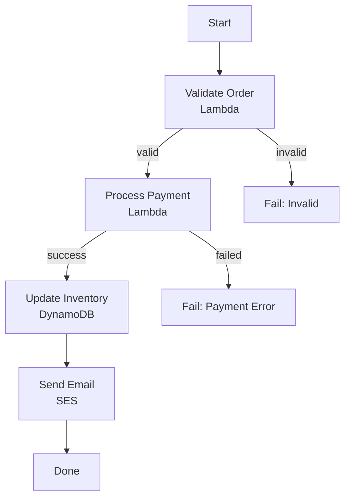
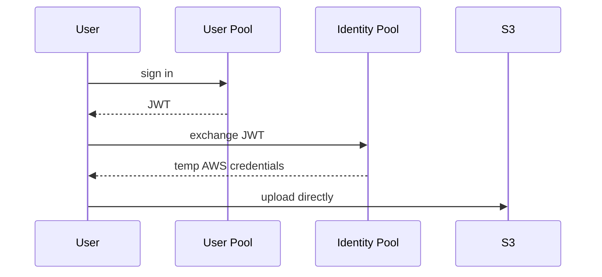
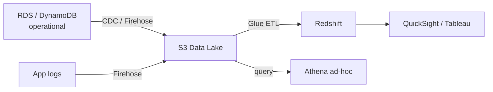

# Data Services

Managed databases and data-driven services: RDS and caching, DynamoDB, orchestration and identity with Step Functions & Cognito, and how to pick between them.

## RDS & Caching

### Multi-AZ vs Read Replicas (the most reliably asked RDS question)

Different features, different problems — candidates conflate them.

**Multi-AZ = high availability / DR (disaster recovery).** Synchronous standby in a different AZ — every write confirmed only after landing on the standby. On primary failure, RDS promotes the standby and updates the DNS endpoint; the app reconnects to the same endpoint. No manual intervention. The standby **cannot serve reads** in standard Multi-AZ. Failover: 60–120 seconds.

**Read Replicas = read scalability.** Asynchronous replication (lag: ms to seconds). Serve read traffic to offload the primary. Same AZ, cross-AZ, or cross-region (also a DR option). Can be manually promoted to standalone (breaks replication).

```
Multi-AZ (HA):                       Read Replica (Scale):

Primary DB ──sync──▶ Standby DB      Primary DB ──async──▶ Replica 1
     │                    │                │         ──async──▶ Replica 2
     └── same endpoint ───┘                │         ──async──▶ Replica 3
         (DNS failover)                    │
                                      App reads from replicas
                                      App writes to primary
```

### Aurora

AWS's cloud-native RDBMS, MySQL/PostgreSQL compatible. Separates **storage from compute**: storage replicates 6 ways across 3 AZs automatically. Failover typically **under 30s** (vs 60–120s for RDS Multi-AZ).

Aurora replicas **share the primary's storage** — no data replication needed, just log-position tracking. Adding replicas is fast, minimal lag, and no performance hit on the primary (unlike RDS read replicas, which add replication load).

**Aurora Global Database** — one primary region + read-only secondary regions, replication lag under a second. Global low-latency reads and cross-region DR with RPO < 1s (RPO = recovery point objective: how much data you can afford to lose).

### RDS Proxy

Sits between app and DB, **pools connections**. Solves: databases have finite connections; hundreds of Lambdas/containers each opening connections exhaust the limit. Proxy multiplexes hundreds of app connections onto a few real DB connections.

Bonus: during failover it holds connection requests and reconnects afterward — failover is nearly invisible to the app.

### ElastiCache — Redis vs Memcached

Rule of thumb: unless you have a specific reason for Memcached, **use Redis**.

| | Redis | Memcached |
|---|---|---|
| Persistence | Yes | No |
| Replication | Yes | No |
| Extras | Pub/sub, sorted sets, transactions | Pure LRU (least-recently-used) cache |
| Architecture | Single-threaded | Multithreaded (raw throughput) |

Memcached only for max-throughput simple key-value where durability doesn't matter.

### Caching patterns

**Cache-aside (lazy loading)** — check cache; on miss, read DB, populate cache, return. Cache only holds requested-once data. Stale data accumulates if TTL too long or invalidation is missed.

**Write-through** — every DB write also writes the cache. Cache always fresh; costs write latency (two writes) and fills the cache with data that may never be read.

```
Cache-aside:

App → Cache: GET user:123
Cache → App: MISS
App → DB: SELECT * FROM users WHERE id=123
DB → App: {id: 123, name: "Priya"}
App → Cache: SET user:123 {...} EX 300    ← 300s TTL
App → Client: return user data
```

## DynamoDB

Serverless key-value/document DB, single-digit ms at any scale. The mental shift: **design the data model around your access patterns upfront** — no query planner, no ad-hoc joins later.

### Data model

- **Primary key** = partition key alone, or partition + sort key.
- **Partition key** — hashed to pick the physical partition; same key = same partition, ordered by sort key.
- **Sort key** — orders items within a partition, enables range queries ("orders for user X in last 30 days"). Without it: exact-match lookups only.
- **Schemaless** items, but **400KB max item size** — large payloads go to S3 with a reference in DynamoDB.

### Partition key design — the most important concept

Each partition: 3,000 RCU / 1,000 WCU (read/write capacity units — defined in the capacity section below). Too much traffic on one partition key = **hot partition** = throttling even when total table capacity is fine.

```
Bad:  PK = "status" (PENDING/COMPLETE)  → 90% of traffic hits one partition
      PK = date at day granularity      → today's writes pile onto one partition
Good: PK = userId, orderId, UUID        → even distribution
      Time-series you must partition by time → write sharding (random suffix,
      fan-out reads across shards)
```

### GSI vs LSI

| | LSI | GSI |
|---|---|---|
| Keys | **Same partition key**, different sort key | Completely different partition (+sort) key |
| When created | **At table creation only — cannot add later** | Any time |
| Scope | Single partition queries only | Any access pattern |
| Throughput | Shares the base table's | Own independent provisioned capacity |
| Consistency | Can be strongly consistent | **Eventually consistent** — read-after-write may miss |

Example: base table `PK=orderId` can't answer "all orders for customer C" → add GSI `PK=customerId, SK=timestamp`.

### Consistency & capacity

- **Eventually consistent reads** (default): cheaper. **Strongly consistent**: 2x RCU, higher latency — only where stale reads break correctness (inventory, balances).
- **Provisioned mode**: specify RCU/WCU (1 RCU = 1 strong read/s ≤4KB; 1 WCU = 1 write/s ≤1KB); cheaper for steady load; pair with Auto Scaling.
- **On-demand**: pay per request, no planning, no throttling on spikes — new/unknown/variable workloads.
- **Transactions**: up to 100 items across tables, 2x cost — don't use where atomicity isn't needed.

### DAX

In-memory cache purpose-built for DynamoDB: microsecond reads, **write-through**, zero application code changes (vs ElastiCache's cache-aside logic). Only works with DynamoDB.

### Streams — change data capture

Time-ordered item-level modifications, retained 24h. Canonical pattern: stream record → Lambda → update OpenSearch index / invalidate ElastiCache / notify / replicate. DynamoDB's equivalent of a WAL.

### Global Tables

Multi-region **multi-master** replication — any region accepts writes; last-writer-wins conflict resolution; sub-second lag. Active-active global architectures with local read/write latency.

## Step Functions & Cognito

### Step Functions — serverless orchestration

#### The problem

Chaining Lambdas (A calls B calls C) creates tight coupling, messy error handling ("step 3 failed after step 2 succeeded — now what?"), invisible workflows, manual retries.

Step Functions replaces it with a managed **state machine**: transitions, retries, parallel branches, error handling — declarative, visual, auditable, resumable from any failed step.



#### Standard vs Express

| | Standard | Express |
|---|---|---|
| Max duration | **1 year** | **5 minutes** |
| Execution guarantee | Exactly-once | At-least-once |
| Pricing | Per state transition | Per execution + duration |
| Use | Long business processes, approvals | High-frequency short workflows (thousands/sec) |

Cost trap both ways: Standard for high-frequency short executions = very expensive; Express for long processes = history isn't durable + 5-min cap.

**Not a message queue**: it orchestrates a fixed sequence for one execution. "Process 10,000 orders in parallel" → SQS + consumers, not Step Functions.

### Cognito

#### User Pools vs Identity Pools (the single most asked Cognito question)

- **User Pool** — managed user directory: sign-up/sign-in, passwords, MFA, federation (Google/Facebook/SAML). Output: **JWT** (ID + access token). Answers: *who is this user?*
- **Identity Pool** — exchanges any identity token (User Pool, Google, OIDC) for **temporary AWS credentials** via STS. Answers: *what AWS resources can this user touch directly?*

Common architecture — both together: User Pool authenticates → JWT → Identity Pool exchanges it for STS credentials scoped to an IAM role → the client calls S3/DynamoDB **directly** from browser/app.



#### Cognito + API Gateway

Simpler pattern for web APIs: User Pool issues JWT → frontend sends `Authorization: Bearer <token>` → **API Gateway validates against the User Pool natively** — no Lambda authorizer, no backend auth code. Standard serverless auth.

Gotcha: access tokens expire (default 1h). Refresh-token logic is **the app's job** — without it, users get silent 401s after an hour.

## Choosing the Right Database

Scenario questions — the right answer is never just a name: state the workload characteristics, then the choice, then the reason.

### The scenarios

| Scenario | Choice | Why |
|---|---|---|
| Payments: users, accounts, transactions | **PostgreSQL (RDS/Aurora)** | ACID — debit and credit succeed or fail together; stable schema, well-defined relations |
| Product catalogue, per-item-type attributes (shirt: size; laptop: RAM) | **DynamoDB** | Schemaless items, key lookups, unpredictable scale, ms reads. Nullable-column or EAV SQL tables are the anti-pattern |
| Sessions / query cache, sub-ms latency | **ElastiCache Redis** | Ephemeral KV, TTL, atomic ops, pub/sub |
| Product search: fuzzy match, ranking, facets | **OpenSearch** | Full-text search engine. Keep the source of truth in RDS/DynamoDB; sync via Streams/CDC — it's a **rebuildable secondary index** |
| BI: complex SQL over 3 years of orders | **Redshift** | Columnar warehouse for analytics — never run analytics on the operational DB; ETL (Glue/Firehose) loads it |
| Query logs in S3, no infrastructure | **Athena** | Serverless SQL over S3 (Parquet/JSON/CSV); pay per TB scanned → **partition by date/service or bills explode** |

### Athena vs Redshift

| | Athena | Redshift |
|---|---|---|
| Data | Stays in S3 | Loaded into Redshift |
| Management | None | Cluster (or serverless) |
| Latency | Seconds–minutes (data-size bound) | Seconds (with good sort/dist keys) |
| Cost | Per TB scanned | Per hour / per query |
| Best | Ad-hoc, log analysis, data lakes | Repeated BI queries, dashboards |

### The typical analytics pipeline



### Wrong answers to avoid

- **"RDS for everything"** — wrong when schema varies per item, scale is unpredictable, or access is pure key-lookup with no joins.
- **"DynamoDB for everything"** — wrong when you need ad-hoc queries, complex filtering, or multi-item transactions.
- **OpenSearch as the only store** — no replay/rebuild if it corrupts; always keep a primary source of truth.
- **Unpartitioned Athena** — every query scans everything; partition from day one.
