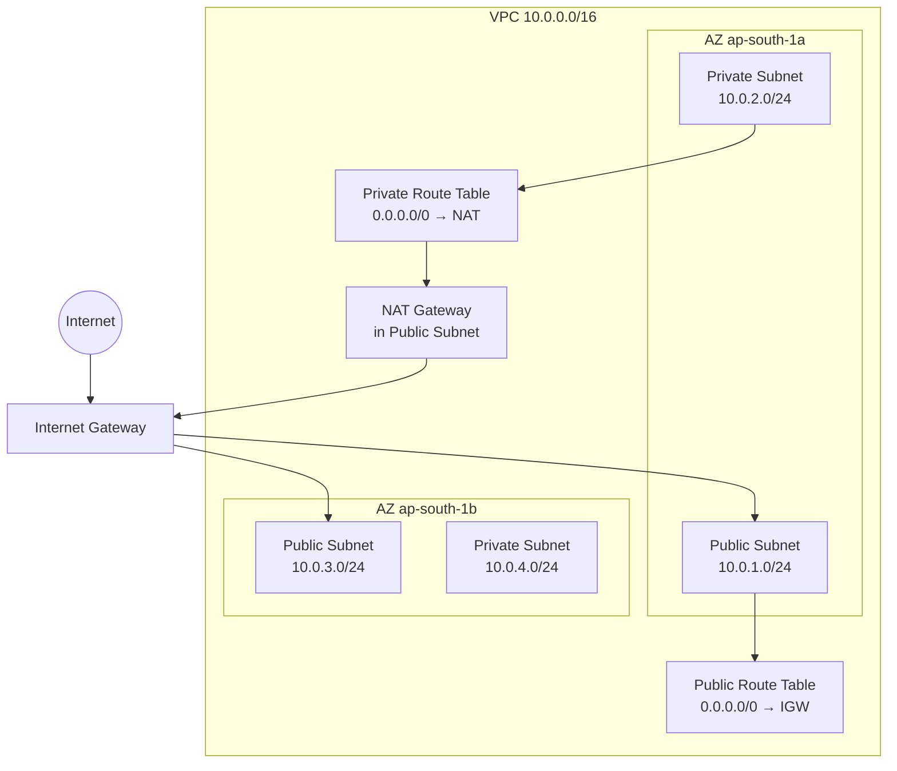
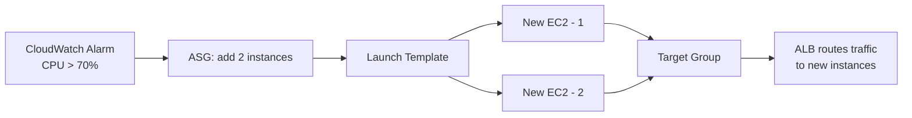

# AWS Foundations

The core building blocks: identity (IAM), networking (VPC), compute (EC2), storage (S3), and traffic distribution (load balancing & auto scaling).

## IAM — Identity & Access Management

### Why IAM exists

Every AWS API call — from your laptop, an EC2 instance, or a Lambda — must be **authenticated** (who are you?) and **authorized** (are you allowed?). IAM answers both. Without it you'd embed long-lived credentials everywhere (dangerous) or have no access control at all.

### Root account

The original account created at signup. Unrestricted access, including root-only actions (close account, change payment). The rule: **lock it away** — enable MFA, generate no access keys, use it only for root-only tasks. If root creds leak, blast radius is total.

### Users, Groups, Least Privilege

- **IAM User** — maps 1:1 to a human or long-lived service identity.
- **Group** — collection of users; attach policies to the group, members inherit them. Groups cannot contain groups.
- **Least privilege** — grant only what the job needs. Start from zero and add incrementally, never start broad and trim later.

### Policies — the core of authorization

A policy is a JSON document: what **actions** are allowed/denied on which **resources** under what **conditions**. Every API call resolves to allow or deny by evaluating all applicable policies.

```json
{
  "Version": "2012-10-17",
  "Statement": [
    {
      "Effect": "Allow",
      "Action": ["s3:GetObject", "s3:PutObject"],
      "Resource": "arn:aws:s3:::my-bucket/*",
      "Condition": {
        "StringEquals": {
          "aws:RequestedRegion": "ap-south-1"
        }
      }
    }
  ]
}
```

#### The three policy types

AWS doesn't check one policy — it gathers **every** policy applying to a request and evaluates them together. The three places a decision can come from:

| | Attached to | Answers | Example |
|---|---|---|---|
| **Identity policy** | The *caller* (user, group, role) | What is the caller allowed to do? | "Priya may `s3:GetObject` on `my-bucket`" |
| **Resource policy** | The *resource* (S3 bucket policy, KMS key policy, SQS queue policy) | Who may touch this resource? | "Account 9999 may read this bucket" — this is the type used for cross-account access and public buckets |
| **SCP** | The *account* (via AWS Organizations) | What is the maximum anyone in this account may ever do? | "Deny all EC2 outside ap-south-1" — caps everyone, including the account's root |

#### Policy evaluation logic (heavily asked)

1. **Explicit Deny** anywhere (SCP, resource policy, identity policy) → **DENY**. Cannot be overridden by any allow.
2. **Explicit Allow** → **ALLOW**.
3. Neither → **implicit DENY** (default).

```
SCP on her account  ────┐
Identity policy     ────┼──> all evaluated together ──> explicit deny anywhere? DENY
Bucket policy       ────┘                              else explicit allow?    ALLOW
                                                       else                   implicit DENY
```

Worked example: Priya's identity policy allows `s3:GetObject`, and the bucket policy allows her too — but the org's SCP denies S3 outside `ap-south-1`, and she's in `eu-west-1`. **DENY.** One deny beats every allow.

Same-account vs cross-account: if Priya and the bucket are in the **same account**, access is granted when *either* her identity policy *or* the bucket policy allows it — one yes is enough. **Cross-account** needs *both* sides to allow: her identity policy must let her touch the other account's bucket, AND that account's bucket policy must let her in. Like visiting your own house (your key suffices) vs someone else's house (you need permission to go AND the owner must open the door).

Trap: "Can an admin Allow something an SCP denies?" — No. SCPs are organization-level guardrails; even the account root user cannot override an SCP deny.

### Roles — the right way to give services access

A **Role** is a set of permissions that anyone *allowed to take it on* can temporarily use. Every role is made of **two policies** — remember this pair, everything about roles follows from it:

| Policy on a role | Answers |
|---|---|
| **Trust policy** | *WHO* may assume the role (the role's guest list) |
| **Permission policy** | *WHAT* the role can do once assumed |

The clearest way to see a role — compare with a user:

| | IAM User | IAM Role |
|---|---|---|
| What it is | A permanent identity (a person or service) with its own login/keys | A bundle of permissions with **no** permanent credentials |
| Credentials | Long-lived password / access key | None. Whoever assumes it gets **temporary** keys from STS (expire in 15 min – 12 hrs) |
| Used by | Humans, long-lived services | Anything that needs access *for a while*: EC2 instances, Lambdas, another AWS account |
| Analogy | A employee badge (yours, forever) | A visitor's day pass — handed to whoever is authorized, expires automatically |

So "assuming a role" = swapping your own permissions for the role's permissions, temporarily. When the temporary credentials expire, they're gone — nothing to revoke, nothing to leak.

#### Why roles exist

Without them, you'd put a long-lived access key on every instance — keys leak everywhere (configs, backups, logs), revoking one means hunting down every copy, a shared key gives 50 instances identical permissions, and CloudTrail can't tell which instance acted. Temporary credentials fix all of this *by design*: they expire on their own, and each assumption is separately logged. In short — roles turn "protect a secret forever" into "let AWS check who's allowed on every request."

The classic example: an EC2 instance needs to read S3. Never put user access keys on the instance (any process with shell access can read them). Attach an IAM Role instead — the app calls the metadata endpoint (`http://169.254.169.254/latest/meta-data/iam/security-credentials/`) and gets rotating credentials automatically. You never manage a secret.

```
EC2 Instance
    │ assumes role via instance profile
    ▼
IAM Role: ec2-s3-read-role
    │ has attached policy
    ▼
Policy: Allow s3:GetObject on arn:aws:s3:::my-bucket/*
```

An **Instance Profile** is a wrapper around an IAM Role that lets it be attached to an EC2 instance — you attach the *profile* to the instance, and the instance gets the *role's* permissions. Yes, it's the IAM Role from the definition above — a role cannot be attached to EC2 directly, only through its profile. In practice the terms are used interchangeably (and the console quietly creates the profile for you), which is why they feel like one thing.

### STS and AssumeRole — cross-account access

**STS (Security Token Service)** is the AWS service that hands out temporary credentials. Calling `sts:AssumeRole` returns a temporary Access Key ID, Secret Key, and Session Token that expire after 15 min – 12 hours. When someone says "roles use short-lived credentials," STS is the thing issuing them.

Cross-account pattern: app in Account A needs a database in Account B. Create a role in B whose **trust policy** (the WHO-may-assume-me policy from the table above) allows A to assume it — B's side: the door opens. The app's own identity policy must also allow `sts:AssumeRole` on that role's ARN — A's side: permission to go. Cross-account needs *both* sides, per the rule above. The app then calls `sts:AssumeRole` and gets credentials scoped to B.

```json
// Trust policy on the role in Account B:
// "Account A (111122223333) may assume this role"
{
  "Statement": [{
    "Effect": "Allow",
    "Principal": { "AWS": "arn:aws:iam::111122223333:root" },
    "Action": "sts:AssumeRole"
  }]
}
```

### Permission boundaries

A policy attached to a user/role that sets the **maximum** permissions that identity can ever have. It does not grant anything — it caps. Platform teams use it so developers can create their own roles without escalating to admin.

**Example**: developers create their own roles; platform team attaches this boundary to each one:

```json
// Permission boundary — the ceiling
{ "Statement": [{
    "Effect": "Allow",
    "Action": ["s3:*", "dynamodb:*", "sqs:*", "logs:*"],
    "Resource": "*"
}]}
```

| Layer | Written by | Answers |
|---|---|---|
| Identity policy | Developer | What is the role *granted*? |
| Permission boundary | Platform team | What is the role *capable of*, ever? |

**Effective permissions = identity policy ∩ boundary.** A developer role with `"Action": "*"` still only gets S3/DynamoDB/SQS/logs — everything outside the cap is inert. A ceiling, not a grant. (SCP = ceiling on a whole *account*; boundary = ceiling on one *role/user* — neither grants anything.)

## VPC & Networking

### Why VPC exists

Before VPC, all AWS resources shared a flat network — any EC2 could reach any other. A **VPC** (Virtual Private Cloud) is your isolated network inside AWS where you control the IP range, subnets, routing, and connectivity. Your own private data centre inside AWS.

### Building blocks

**CIDR** defines the IP range. `10.0.0.0/16` = 65,536 addresses, sliced into subnets.

**Subnets** are subdivisions of a VPC, each pinned to one **AZ (Availability Zone)** — a physically separate data centre within a region. `10.0.1.0/24` = 256 addresses (AWS reserves 5 → 251 usable). Public/private is **not** a property of the subnet — it comes from what's connected to it:

- **Public subnet** — has a route to an Internet Gateway (IGW); resources can hold public IPs.
- **Private subnet** — no route to the IGW; not reachable directly from the internet. Databases and sensitive services live here.



### Internet Gateway vs NAT Gateway

**IGW (Internet Gateway)** — attached to the VPC, enables bidirectional internet connectivity. For a resource in a public subnet to reach the internet, **all three** must be true: it has a public IP, the subnet's route table routes `0.0.0.0/0` to the IGW, and the **Security Group** (the instance-level firewall — section below) allows the traffic.

**NAT Gateway** — lives in a public subnet; lets private-subnet resources **initiate outbound** connections (patches, external APIs) without being reachable from the internet. One-directional: translates private IP → NAT's public IP for outbound and maps responses back; unsolicited inbound is dropped. Costs per hour + per GB processed — a real operational cost at scale.

### Route tables

A **route table** is attached to each subnet: a list of rules saying "packets going to destination X are sent to target Y." **Most specific rule wins**; the `local` rule (the VPC's own IP range) always exists and can't be removed.

```
Incoming packet — user hits 54.123.45.67 (instance's public IP):
1. IGW rewrites it to the private IP: 10.0.1.50
2. Route table: 10.0.1.50 is inside 10.0.0.0/16 → local → delivered

Outgoing packet — instance calls 142.250.x.x (external server):
1. Route table: 142.250.x.x matches 0.0.0.0/0 → send to IGW
2. IGW rewrites the source to the public IP → out to the internet

(The reply from the server is just another incoming packet — step 1 again.)
```

### Security Groups vs NACLs

One of the most reliably asked SRE comparison questions.

|            | Security Group                             | NACL                                           |
| ---------- | ------------------------------------------ | ---------------------------------------------- |
| Level      | Instance                                   | Subnet                                         |
| State      | **Stateful** (return traffic auto-allowed) | **Stateless** (in/out evaluated independently) |
| Rules      | Allow only                                 | Allow **and** Deny                             |
| Evaluation | All rules                                  | By rule number, lowest wins                    |

SG stateful means: allow inbound 443 → response goes out automatically. NACL stateless means: allow inbound 443 → you must also allow outbound **ephemeral ports 1024–65535** (the random high ports the client OS picks for the *response* side of a connection) or the connection fails coz you allowed only 443.

**Rule fields — SG**: protocol, port range, source/destination.
**Rule fields — NACL**: same protocol/port/CIDR fields, plus two NACL-only ones:


Practice: SGs are the primary control. NACLs are the last line of defence for blocking a known bad IP with an explicit Deny.

### VPC endpoints

The story: your EC2 (private subnet) wants to talk to S3. S3 lives on the public internet, so by default the traffic goes out through the NAT Gateway — and NAT charges per GB. You're paying Amazon to talk to Amazon. Dumb.

**VPC endpoint** = a shortcut that lets your instance talk to AWS services without leaving AWS's private network. Two flavours:

- **Interface endpoint** — Amazon puts a little network card (ENI) with a private IP inside your subnet. Your instance talks to that IP instead of going through NAT; Amazon carries the traffic to the service over its own internal network. Works with almost every AWS service (SQS, CloudWatch, Secrets Manager, ECR…). Costs money per hour + per GB.
- **Gateway endpoint** — no network card. Just one extra line in your route table: "traffic going to S3 goes through this door instead of the NAT." Only S3 and DynamoDB. **Free.**

Remember: **Gateway = free, but only S3 + DynamoDB → always use it for those two. Interface = everything else, but you pay.**

#### How Gateway actually works (S3 example)

The trick: all of S3's public IPs in your region are published as a **prefix list** — a named list of CIDR blocks, e.g. `pl-63a5400a`. Creating the gateway endpoint and attaching it to your private subnet's route table adds exactly one route:

```
Destination: pl-63a5400a (S3) → Target: vpce-0abc123 (gateway endpoint)
```

When your instance calls `my-bucket.s3.ap-south-1.amazonaws.com`, DNS resolves it to a public IP — but that IP sits inside the prefix list, and **most specific route wins**: the packet matches the prefix-list route instead of `0.0.0.0/0 → NAT`, and AWS carries it to S3 over its internal network.

Notice what *didn't* change: no config on the instance, no code change, not even a different URL. The route table did all the work. That's also why it's free — it's a routing entry pointing at S3 infrastructure that already exists, no dedicated hardware for you.

Two extras:

- **Endpoint policy** — an IAM-style policy attached to the endpoint itself, restricting what traffic through it may do (e.g. "only bucket `my-bucket`, read-only"). IAM still applies on top.
- **Same region only** — the prefix list covers S3 IPs in *your* region. Cross-region S3 calls still go out through NAT.

#### How Interface actually works (Secrets Manager example)

No route-table magic here — plain IP networking plus a DNS swap:

1. **Create the endpoint, pick subnets** (one per AZ for HA). AWS plants an ENI with a private IP (e.g. `10.0.2.99`) in each chosen subnet. This ENI is the "door", it's what you pay hourly for.
2. **Private DNS** (on by default) — inside your VPC, the service's *normal* hostname (`secretsmanager.ap-south-1.amazonaws.com`) now resolves to the endpoint's private IP instead of a public one. Your app keeps the same URL; the traffic silently reroutes. Outside the VPC it still resolves publicly, so nothing else breaks.
3. **Security group on the ENI** — the endpoint ENI has its own SG. Allow inbound TCP 443 from your instance's SG, or the connection hangs. Classic gotcha: endpoint exists, curl times out → 90% of the time it's this missing rule.
4. Instance → `10.0.2.99:443` (local IP in your subnet) → ENI → AWS's internal network → the service. The NAT route is never even consulted, because the destination is inside your VPC.

Why it costs money: AWS is running real ENIs (plus the PrivateLink plumbing behind them) per endpoint, per subnet, per AZ — that's the hourly + per-GB charge.

**One-line summary: Gateway = a route-table trick (prefix list beats NAT). Interface = a private IP in your subnet + a DNS swap so your app doesn't notice.**

### VPC peering

Connects two VPCs so resources talk over private IPs. Key constraint: **non-transitive**. A↔B and B↔C peered does not let A reach C through B — you need direct A↔C peering or **Transit Gateway** for hub-and-spoke at scale.

---

### At scale

#### Transit Gateway vs peering

Peering connects 2 VPCs, and only those 2. Connect many VPCs to each other and the connections multiply — 10 VPCs fully connected = 45 separate links to manage. **Transit Gateway (TGW)** is the fix: one central hub, every VPC plugs into it once (10 VPCs = 10 attachments), and TGW routes between them all.

TGW costs money (per attachment/hour + per GB). So: few VPCs (2–3) → plain peering, simpler and cheaper. Many (4–5+) → TGW.

#### Endpoints — which type where

- **Gateway endpoints** — S3 and DynamoDB **only**; free. Never recommend Interface endpoints for these two.
- **Interface endpoints (PrivateLink)** — every other service; a private IP (ENI) in your subnet, hourly + per-GB cost.

**PrivateLink** also exposes *your own* services privately to other VPCs/accounts — a platform team's shared internal APIs without peering.

#### Hybrid connectivity — DX + VPN

Direct Connect (**DX**) = dedicated private circuit: consistent latency/bandwidth, but one circuit is one **SPOF (single point of failure)**. Production pattern: **DX primary + Site-to-Site VPN failover**, both terminating on the same **VGW (Virtual Private Gateway — the VPC's VPN/DX attachment point)** or TGW — **BGP (the routing protocol that announces which path is alive)** shifts traffic automatically if DX fails.

#### Network Firewall

Dedicated firewall subnet per AZ between IGW and app subnets: stateful/stateless rules, **IPS (intrusion prevention)**, domain filtering — beyond what SGs/NACLs do. Ingress: IGW → Network Firewall → ALB subnet → app. Egress: private subnet → Network Firewall → NAT → IGW.

## EC2 — Elastic Compute Cloud

### Instance types

Naming: `[family][generation].[size]` — e.g. `c6i.xlarge` = Compute-optimised, 6th gen, Intel, xlarge.

| Family            | Series | Use case                                             |
| ----------------- | ------ | ---------------------------------------------------- |
| General Purpose   | T / M  | Balanced workloads                                   |
| Compute Optimised | C      | Batch, game servers, transcoding                     |
| Memory Optimised  | R      | In-memory DBs, large caches                          |
| Storage Optimised | I      | High-IOPS (I/O ops/sec) DBs, distributed filesystems |

**T-series is burstable**: accumulate CPU credits while idle, spend them on spikes. Credits exhausted → throttled. Production trap: a T3 fine in a 10-minute load test can throttle under 30 minutes of sustained real traffic.

### Purchasing options

- **On-Demand** — pay per second, no commitment. Unpredictable workloads.
- **Reserved Instances** — 1 or 3-year commit to a specific type/region, up to 72% cheaper. Trap: locked to that instance type (Convertible RIs trade flexibility for less discount).
- **Savings Plans** — commit to $/hour spend. Discount applies across families and even Lambda/Fargate. Compute Savings Plans most flexible; EC2 Instance Savings Plans deeper discount per family.
- **Spot** — up to 90% cheaper; AWS reclaims with a **2-minute warning**. App must drain connections, checkpoint state, complete in-flight work. Batch jobs, data processing, stateless tiers behind an ASG (Auto Scaling Group).
- **Capacity Reservations** — guarantee capacity in a specific AZ. No discount, just availability. Pre-spike (sales events).
- **Dedicated Hosts** — entire physical server. Per-socket/per-core licensing or single-tenant compliance.

### User data and instance metadata

**User Data** — bootstrap script, runs once at first boot as root, before the app:

```bash
#!/bin/bash
yum update -y                                        # Patch OS on first boot
aws s3 cp s3://my-bucket/config /etc/app/config      # Pull config from S3
systemctl enable --now my-app                        # Start the application
```

**Instance Metadata** at `http://169.254.169.254/latest/meta-data/` — instance ID, AZ, type, IAM role credentials. No auth on **IMDSv1** → SSRF (server-side request forgery — tricking server code into fetching attacker-chosen URLs) can extract credentials. **IMDSv2** requires a session token (PUT before GET) — current best practice.

### Storage: EBS, EFS, Instance Store

```
Decision tree:
Shared access across many instances?        → EFS
Highest single-instance IOPS (database)?    → io2 EBS
Simple persistent disk for one instance?    → gp3 EBS
Temporary scratch, speed is everything?     → Instance Store
```

**Instance Store** — physically attached to the host. Fastest, but ephemeral: lost on stop/terminate/failure. Scratch space, temp files, rebuildable caches only.

**EBS (Elastic Block Store)** — network-attached drive, persists independently of the instance.

| Type | Notes |
|---|---|
| `gp3` | General SSD; baseline 3000 IOPS independent of size, scale to 16k IOPS; default and usually cheapest |
| `gp2` | Older; IOPS scale with size (3 IOPS/GB, burst to 3000) |
| `io2` | Provisioned IOPS for sub-ms DB latency; **only type supporting multi-attach** |
| `sc1` | Cold HDD, infrequent access, lowest cost |

**Multi-attach caveat**: one io2 volume on multiple EC2s requires a cluster-aware filesystem (GFS2, OCFS2). Plain ext4 will corrupt data.

**EFS (Elastic File System)** — managed NFS (Network File System), mountable by thousands of instances, multi-AZ, scales automatically. Pricier than EBS per GB; essential for shared files (shared config, ML weights, CMS assets).

### Placement groups

- **Cluster** — same rack, one AZ. 10Gbps+ inter-instance bandwidth, lowest latency; rack failure kills everything. HPC (high-performance computing), distributed DBs.
- **Spread** — distinct hardware per instance, max 7 per AZ. Small groups of critical instances avoiding correlated failure.
- **Partition** — logical partitions on separate hardware. Large distributed systems (HDFS, HBase, Cassandra) wanting rack-awareness.

## S3 — Object Storage

### Mental model

S3 is not a filesystem and not a block device. It's an **object store**: every object identified by bucket + key (the full "path"). There is no real directory hierarchy — `/` in a key is just a character the console renders as a folder. Matters for prefix-based access policies.

### Storage classes

```
Hot (frequent access)           → S3 Standard        — 11 nines durability, 3+ AZ
Infrequent but fast retrieval   → S3 Standard-IA     — lower storage cost, retrieval fee
One AZ, lower cost              → S3 One Zone-IA     — lost if AZ fails; reproducible data only
Archival, minutes retrieval     → Glacier Instant Retrieval
Archival, hours retrieval       → Glacier Flexible Retrieval
Deep archive, 12hr retrieval    → Glacier Deep Archive — cheapest; compliance data
Unknown access pattern          → Intelligent-Tiering — auto-moves objects between tiers
```

### Versioning and lifecycle policies

With versioning enabled, every version of every object is kept. `DELETE` adds a **delete marker** — the object isn't actually removed; permanent deletion requires deleting the specific version. Both a safety net and a **storage cost trap**: buckets silently grow as old versions accumulate.

Lifecycle policies automate transitions and expiry:

```json
{
  "Rules": [{
    "ID": "archive-and-expire-logs",
    "Status": "Enabled",
    "Filter": { "Prefix": "logs/" },
    "Transitions": [
      { "Days": 30,  "StorageClass": "STANDARD_IA" },
      { "Days": 90,  "StorageClass": "GLACIER" }
    ],
    "Expiration": { "Days": 365 }
  }]
}
```

### Bucket policies vs ACLs vs IAM policies

- **IAM policies** — attached to identities: "this identity can do X on S3."
- **Bucket policies** — attached to the bucket: "these principals may/may not do X here." Right tool for cross-account access and public buckets.
- **ACLs** — legacy; AWS recommends disabling (Object Ownership → Bucket owner enforced).

Rule: access granted when IAM allows **AND** (bucket policy allows OR no bucket policy). Explicit deny in either → denied.

### Presigned URLs

Time-limited URL letting anyone holding it perform a specific S3 operation (GET/PUT) without AWS credentials. Encodes the signer's credentials, the operation, expiry, and signature.

Canonical use: backend generates a presigned PUT URL → client uploads directly to S3 without the file passing through your servers. Offloads bandwidth and storage from compute.

```
Client → Your API: "I want to upload a file"
Your API → S3: generate presigned PUT URL (expires in 5 min)
Your API → Client: here is the URL
Client → S3: PUT file directly
S3 → Client: 200 OK
```

**Gotcha**: a presigned URL's effective expiry is bounded by the lifetime of the credentials that signed it. An EC2 role whose session expires in 15 min makes a "1-hour" URL die at 15 min.

---

### Replication — CRR and SRR

Asynchronous copy source → destination bucket. **CRR** (cross-region): read latency, DR, data residency. **SRR** (same-region): log aggregation, live copy in a separate account.

Facts that trip people: requires **versioning on both buckets**; only **new** objects replicate (existing ones need S3 Batch Operations); **delete markers are not replicated** by default.

### Encryption

SSE = Server-Side Encryption (AWS encrypts your data when storing it).

| Option | Who manages keys | Notes |
|---|---|---|
| **SSE-S3** | S3 entirely | Default since Jan 2023; zero ops |
| **SSE-KMS** | KMS (AWS- or customer-managed) | CloudTrail-audited key use, key-policy control. **Trap**: high request rates hit KMS throttling — fix with S3 Bucket Keys (up to −99% KMS calls) |
| **SSE-C** | You, per request | AWS never stores the key; **HTTPS mandatory**; rarely used |
| **Client-side** | You, end-to-end | AWS never sees plaintext; regulatory cases |

```
Need key-usage audit?              → SSE-KMS (customer-managed)
Simplest, no audit requirement?    → SSE-S3
Cloud must never see the key?      → Client-side
```

### Event notifications

`object created / deleted / restored / replication failed` → **SNS** (fan-out), **SQS** (async processing), or **Lambda** (direct invoke). Near-real-time but eventually consistent. Glue between S3 and processing pipelines — e.g. Lambda on new log file. **EventBridge** is the newer, more powerful option (filtering, routing, replay).

### Object Lock & Glacier Vault Lock

**S3 Object Lock** = WORM (Write Once, Read Many) per object: no delete/overwrite during retention, even by root. **Governance mode** (special IAM can override) vs **Compliance mode** (nobody — including root — can). Financial/healthcare compliance. **Glacier Vault Lock**: immutable after a 24h confirmation window.

### Access Points

Named endpoints with their own scoped policy, replacing one sprawling bucket policy. Data lake example:

```
Bucket: company-data-lake
    ├── analytics-ap → read-only  /analytics/
    ├── ml-ap        → read-write /ml-features/
    └── de-ap        → read-write /raw/
```

## Load Balancing & Auto Scaling

### The three load balancers

Layers = OSI model levels: **Layer 7** sees the application protocol (HTTP paths, headers), **Layer 4** sees only IP + port, **Layer 3** only IPs.

- **ALB (Application LB)** — Layer 7. Reads HTTP headers, paths, query params, host names. Enables path-based routing (`/api/*` → one target group, `/static/*` → another), host-based routing (multi-tenant), header-based routing (canary: 5% where `X-Canary: true`). Handles SSL termination, WebSockets, HTTP/2.
- **NLB (Network LB)** — Layer 4. IP + port only, no protocol parsing → millions of req/s, ultra-low latency, non-HTTP protocols. **Preserves client IP** by default (ALB does not — use `X-Forwarded-For`). Right choice when you need a **static IP** for the LB.
- **GLB (Gateway LB)** — Layer 3. Transparently inserts third-party appliances (firewalls, IDS/IPS) into the traffic path. Not general-purpose.

### Target groups and health checks

A target group collects targets (EC2, IPs, Lambda, other ALBs). Health checks run per target; unhealthy targets leave rotation. Healthy after passing N consecutive checks (healthy threshold), unhealthy after failing N (unhealthy threshold).

### Sticky sessions

Bind a client to one target for a cookie's lifetime. ALB supports application-based (your app sets the cookie) and duration-based (ALB sets it) stickiness. Problem: uneven load — one target with 60% of long-lived sessions takes 60% of load regardless of fleet size. Right answer: stateless apps, sessions in ElastiCache.

### Cross-zone load balancing

Without it, each LB node serves only targets in its own AZ: 2 targets in AZ-A and 8 in AZ-B with 50/50 AZ split → each AZ-A target gets 25% of total traffic, each AZ-B target 6.25%. With cross-zone on, all targets get an equal share.

- ALB: always on, free.
- NLB / GLB: off by default, inter-AZ data transfer charges apply.

### Auto Scaling Groups

ASG keeps a fleet between min and max; **desired capacity** is the current target. **Launch Templates** (not legacy Launch Configurations) define each instance: AMI (the OS image to boot), type, SGs (Security Groups), IAM role, user data, volumes.

Scaling policies:

- **Target tracking** — most common. "Keep average CPU at 40%"; ASG computes adds/removes. Handles scale-out and scale-in.
- **Step scaling** — proportional response: +2 instances at CPU 60–80%, +4 above 80%.
- **Scheduled** — set desired capacity at a set time for predictable patterns (scale up before 9am spike).
- **Cooldown** (default 300s) — pause after a scaling activity so metrics settle; prevents flapping.


