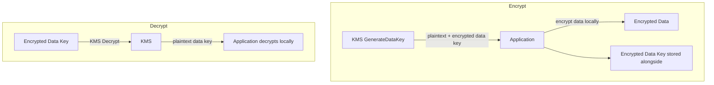
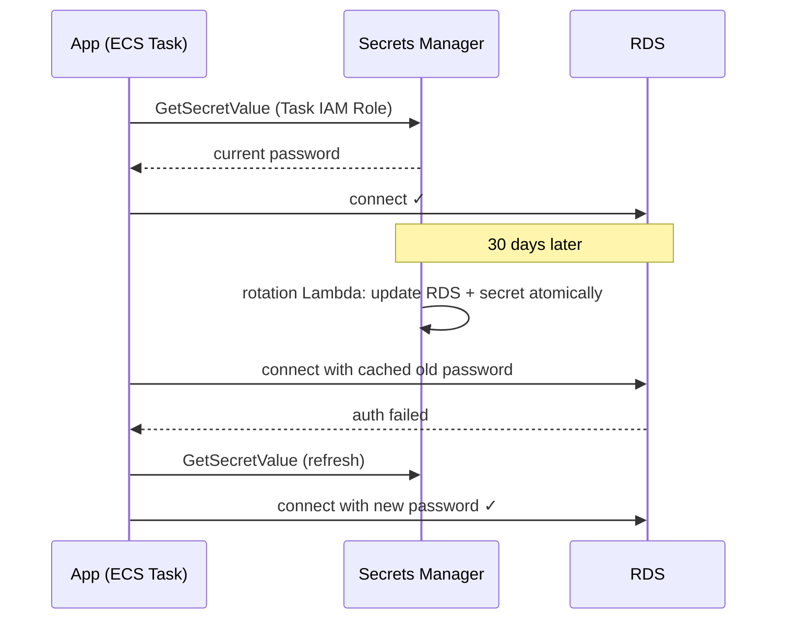

# Security & Operations

Encryption and secrets (KMS), guardrails (Config, Organizations, WAF/Shield/GuardDuty), observability (CloudWatch/CloudTrail), and cost optimisation.

## KMS & Secrets

### KMS — Key Management Service

Every AWS encryption service (EBS, S3 SSE-KMS, RDS, Secrets Manager, CloudTrail logs) bottoms out in KMS. It's the foundation of AWS encryption.

#### Key types

- **AWS-managed keys** (`aws/s3`, `aws/rds`) — created per service, no policy control, no cross-account, auto-rotate yearly. Default when you tick "encryption" without choosing a key.
- **Customer-managed keys (CMK)** — you control policy, rotation, access; cross-account sharing; every use audited in CloudTrail. $1/key/month + API calls. Use when you need audit trails, cross-account encryption, or instant revocation (disable the key).
- **Custom key stores** — CloudHSM-backed; regulatory only.

#### Envelope encryption — the core concept

KMS can't encrypt bulk data (4KB API limit, latency, cost). Instead:

1. KMS `GenerateDataKey` → returns a plaintext **data key** + a copy encrypted by your KMS key.
2. App encrypts data **locally** with the data key; stores encrypted data + encrypted data key; discards the plaintext key.
3. Decrypt: send the encrypted data key to KMS, get plaintext back, decrypt locally.

**KMS never sees your data — only the data key.** Every AWS encryption service works this way under the hood.



#### Key policies

Resource-based policy on the key. **IAM alone is not enough** — the key policy must also grant the principal. Mandatory statement: allow the **account root** — without it the key can become permanently unmanageable and AWS support cannot recover it.

```json
{
  "Statement": [
    { "Effect": "Allow",
      "Principal": { "AWS": "arn:aws:iam::123456789012:root" },
      "Action": "kms:*", "Resource": "*" },
    { "Effect": "Allow",
      "Principal": { "AWS": "arn:aws:iam::123456789012:role/app-role" },
      "Action": ["kms:Decrypt", "kms:GenerateDataKey"], "Resource": "*" }
  ]
}
```

#### Rotation

AWS-managed keys: yearly, automatic. CMKs: enable annual automatic rotation — new key material for **new** encryptions; old material retained to decrypt old ciphertext; ARN unchanged, no app changes. Rotation does **not** re-encrypt existing data.

#### Why SSE-KMS throttles

Every S3 object read/write = a KMS call for the data key. At high rates → KMS quota → `SlowDown` errors. Fix: quota increase or **S3 Bucket Keys** (bucket-level data key, cuts KMS calls by up to 99%).

### Secrets Manager vs SSM Parameter Store

| | SSM Parameter Store | Secrets Manager |
|---|---|---|
| Primary use | Config + secrets | Secrets only |
| Cost | Free (standard) | $0.40/secret/month + API calls |
| Rotation | **Manual — you build it** | **Built-in, automatic via Lambda** (RDS/Redshift/DocumentDB templates) |
| Value size | 4KB (8KB advanced) | 64KB |
| Cross-account | No | Yes (resource policy) |
| Best for | App config, feature flags, non-rotating secrets | DB passwords, API keys, anything needing rotation |

Parameter types: String (plaintext), StringList, **SecureString** (KMS-encrypted — for sensitive values).

### The interview answer: "How does your app get its DB password?"

Password lives in **Secrets Manager** with automatic rotation (e.g. 30 days — a Lambda updates the RDS password and the secret atomically). The app fetches it via its **IAM role** (never hardcoded), caches in memory, and **re-fetches on auth failure** — which signals the secret rotated. Rotation is transparent; no restarts. During rotation both `AWSCURRENT` and `AWSPREVIOUS` are valid because instances may still hold the old password in connection pools.



Anti-patterns: `GetSecretValue` per request (latency + API cost — use the caching client); 200 config params in Secrets Manager ($80/mo — Parameter Store is free); AWS-managed keys for cross-account encryption (need a CMK).

## Governance & Security

### AWS Config — configuration state recorder

| Question | Service |
|---|---|
| Who made this API call, when? | CloudTrail |
| What do the metrics look like now? | CloudWatch |
| **Is the current configuration compliant? What was it at 2am?** | **AWS Config** |

Config continuously records a configuration item per resource change → full timeline. Incident question "what changed?" → "this SG had port 22 closed at 01:50, open at 01:55."

#### Config Rules & auto-remediation

Managed rules (hundreds) + custom Lambda rules evaluate resources → COMPLIANT / NON_COMPLIANT. Remediation pairs a rule with an SSM Automation document: `s3-bucket-public-read-prohibited` fires → SSM removes the public ACL within seconds, no human.

Classic managed rules: `restricted-ssh` (SG with 22 from 0.0.0.0/0), `iam-root-access-key-check`, `rds-instance-public-access-check`, `cloudtrail-enabled`.

**Rules detect, they don't prevent.** Blocking public buckets requires SCPs / bucket policy / Block Public Access — not a Config rule.

### Organizations & SCPs

#### Multi-account strategy

One account for everything is an anti-pattern (blast radius, cost attribution, isolation). Standard: production / staging / dev / security-audit (CloudTrail + Config aggregation) / shared services accounts, grouped into nested **OUs** — OU policies inherit to all member accounts.

#### SCPs — the correct mental model

An SCP sets the **maximum available permissions** for everyone in a member account — including that account's root. It **grants nothing**: an `s3:*` allow-list SCP still requires an IAM allow for anyone to do anything.

Key facts:
- SCPs **do not apply to the management account** — which is why it must never run workloads.
- Typical uses: region lock (data residency), deny CloudTrail/Config disablement, block risky services outside prod, deny root usage.

#### Policy evaluation (definitive)

1. Explicit **Deny** anywhere → DENY (final).
2. Explicit **Allow** → ALLOW.
3. Otherwise → **implicit DENY**. Default is deny, always. Cross-account needs explicit allows on **both** sides (calling identity policy + target resource/trust policy).

### VPC at scale

#### Transit Gateway vs peering

Peering is 1:1 and non-transitive. 10 VPCs fully meshed = 45 connections. **Transit Gateway** = regional hub; each VPC gets one attachment — 10 attachments for 10 VPCs — plus VPN/Direct Connect termination for hybrid. Crossover ≈ 4–5 VPCs; TGW is not free (per attachment/hour + per GB).

#### Endpoints recap (which type where)

- **Gateway endpoints** — S3 and DynamoDB only; route-table entry; **free**. Never recommend Interface endpoints for these two.
- **Interface endpoints (PrivateLink)** — everything else (SQS, ECR, CloudWatch, Secrets Manager…); ENI with private IP in your subnet; hourly + per-GB cost. Motivation: keep traffic off the NAT Gateway.

**PrivateLink** also lets *you* expose your own shared services privately to other VPCs/accounts — platform team's internal APIs without peering.

#### Hybrid connectivity redundancy

Direct Connect = dedicated circuit, consistent latency — but a single circuit is a single point of failure. Production pattern: **DX primary + Site-to-Site VPN failover**, both terminating on the same VGW/TGW; BGP shifts traffic automatically if DX dies.

#### Network Firewall

Dedicated firewall subnet per AZ between IGW and app subnets: stateful/stateless rules, IPS, domain filtering — capabilities SGs/NACLs don't have. Ingress: IGW → NFW → ALB → app. Egress: private subnet → NFW → NAT → IGW.

### The security services — complementary, not competing

| Service | Job |
|---|---|
| **WAF** | L7 filter on CloudFront/ALB/API GW. Web ACLs, ordered rules, managed rule groups (OWASP), **rate-based rules** (block >1,000 req/5min/IP) for credential stuffing |
| **Shield Standard** | Free, automatic L3/L4 DDoS protection for CloudFront/Route 53/ELB. Does **not** cover raw EC2 |
| **Shield Advanced** | ~$3k/mo: EC2/ELB/CF/GA/R53, DDoS Response Team, and **cost protection** — reimburses attack-driven bill spikes (ASG growth, NAT traffic) |
| **GuardDuty** | **Threat detection** from VPC Flow Logs + CloudTrail + DNS logs: recon, C2/crypto-mining, odd-geography API calls, exfiltration. Not inline — analyzes logs. Finding → EventBridge → SNS/Lambda (e.g. auto-swap the SG of a compromised instance) |
| **Inspector** | **Vulnerability scanning**: EC2 CVEs, ECR images (on push + continuous re-evaluation as new CVEs drop), Lambda dependencies. Proactive; GuardDuty is reactive |
| **Macie** | ML discovery/classification of **sensitive data in S3** (PII, credentials); flags exposed/unencrypted buckets |
| **Security Hub** | Aggregates + normalizes (ASFF) findings from all of the above across the org into one dashboard + security score, in a central security account. Needs the source services enabled in each member account or the dashboard is empty |

### Shared responsibility model

**AWS: security OF the cloud** — hardware, hypervisor, managed-service engine patching (you don't patch RDS).
**You: security IN the cloud** — always: IAM, data classification/encryption choices, network controls, app security.

The more managed the service, the more shifts to AWS — EC2 (you patch the guest OS) → RDS (AWS patches the engine; you own config, data, SGs) → Lambda/S3 (you own code, IAM, bucket/encryption policy). You never fully hand it over.

## Observability — CloudWatch vs CloudTrail

### The distinction

- **CloudWatch** — "What is my infrastructure doing right now?" Metrics, logs, alarms, dashboards. The operational monitoring layer.
- **CloudTrail** — "Who did what in my AWS account?" Records every API call: who, from where, with what parameters, when. The audit/compliance layer.

Trap question: "An S3 bucket's permissions were changed last night — how do you find out who did it?" → **CloudTrail**. CloudWatch shows traffic changes, not the API call that modified the bucket policy.

### CloudWatch metrics

AWS services publish automatically: EC2 → CPU, network in/out, disk I/O. RDS → connections, read/write IOPS, replication lag. Custom metrics can be published from apps.

**Consistently asked caveat**: EC2 does **not** publish memory utilisation or disk space usage by default — those live inside the OS and require the **CloudWatch Agent**.

Retention: 15 months for standard metrics; high-resolution (sub-minute) only 3 hours. Longer retention → export to S3 or a third party.

### CloudWatch Logs

Ship via Agent or SDK. Organised into **Log Groups** (one per app/service) and **Log Streams** (one per instance/container). **Log Insights** queries logs with SQL-like syntax.

### CloudWatch alarms

Watch a metric over a window; states OK / ALARM / INSUFFICIENT_DATA. On ALARM: SNS notification, ASG scaling policy, or EC2 action.

```yaml
CPUAlarm:
  Type: AWS::CloudWatch::Alarm
  Properties:
    AlarmName: high-cpu-api-service
    MetricName: CPUUtilization
    Namespace: AWS/EC2
    Statistic: Average
    Period: 60                    # Evaluate every 60s
    EvaluationPeriods: 3          # Breach for 3 consecutive periods
    Threshold: 80
    ComparisonOperator: GreaterThanThreshold
    AlarmActions:
      - !Ref ScalingPolicy
```

### CloudTrail

Logs every management API call (resource creation/deletion, IAM changes) as an event, stored in S3. Console retention is 90 days by default; for longer retention and querying, deliver to S3 (+ optionally CloudWatch Logs).

**Not real-time** — up to 15 minutes of delay. For real-time alerting on sensitive actions (root login, IAM changes), send events to CloudWatch Logs and build metric filters + alarms.

## Cost Optimisation

Cost is an SRE responsibility, not finance's. Two interview forms: "how do you reduce cost?" and "your bill spiked 40% — walk me through the investigation."

### EC2 levers

- **Commitment discounts** — On-Demand only for truly unpredictable load. Baseline 24/7 load → Reserved Instances (up to −72%, locked to type/region) or **Savings Plans** (up to −66%, flexible across families/regions/Fargate/Lambda — usually the right pick).
- **Right-sizing** — Compute Optimizer on CloudWatch metrics; an `m5.4xlarge` at 10% CPU → `m5.xlarge` = −75% for that instance.
- **Spot** (−90%) for fault-tolerant tiers: batch, data processing, stateless behind ASG — provided apps handle the 2-minute notice.

### RDS traps

- **Multi-AZ doubles cost** — right for production, waste in dev/staging.
- Read replicas: full instance price each; size replicas to the *read workload*, not by copying the primary.
- RDS Reserved Instances don't cross instance families — a `db.r5` reservation won't cover a `db.r6g` migration.

### NAT Gateway — the silent killer

Charges **per hour ($0.045/h) AND per GB processed ($0.045/GB)**. All S3 reads + ECR pulls + external calls through NAT = thousands/month in processing alone.

Fixes by traffic type: S3/DynamoDB → **Gateway Endpoints (free)**. ECR/CloudWatch/Secrets Manager/SQS → Interface Endpoints (cheaper than NAT at volume). Audit what remains: NAT's `BytesOutToDestination` metric → VPC Flow Logs → destination IPs → replace with endpoints.

### S3

- **Lifecycle transitions** (30d → Standard-IA, 90d → Glacier) and expiry.
- **Versioning accumulates silently** — pair with a non-current-version expiry rule, always.
- Internet egress from S3 = $0.09/GB; **CloudFront in front** is cheaper and faster (cache hits = zero origin transfer).

### "AWS bill spiked" — investigation flow

```
1. Cost Explorer → which service? which region?
2. Break down by usage type → compute? storage? data transfer?
3. Break down by resource tag → which team/app?
4. EC2:   ASG scaled out without scale-in? new instance type? Spot→On-Demand fallback?
5. NAT:   BytesOutToDestination → Flow Logs → which destinations?
6. S3:    non-current versions? egress? expensive LIST storms?
7. RDS:   new replica? Multi-AZ enabled? storage auto-growth (never shrinks)?
8. Data transfer: cross-AZ ($0.01/GB each way), cross-region, egress
```

### More traps

- **Savings Plan commitments are irrevocable** — commit only to the guaranteed 24/7 baseline; everything above stays On-Demand/Spot.
- **Cross-AZ transfer is billed even inside one VPC** — co-locate chatty compute+data in one AZ (accepting the availability tradeoff).
- **Glacier retrieval isn't free** — frequent queries on "archived for savings" data can cost more than Standard-IA. Model retrieval frequency first.
