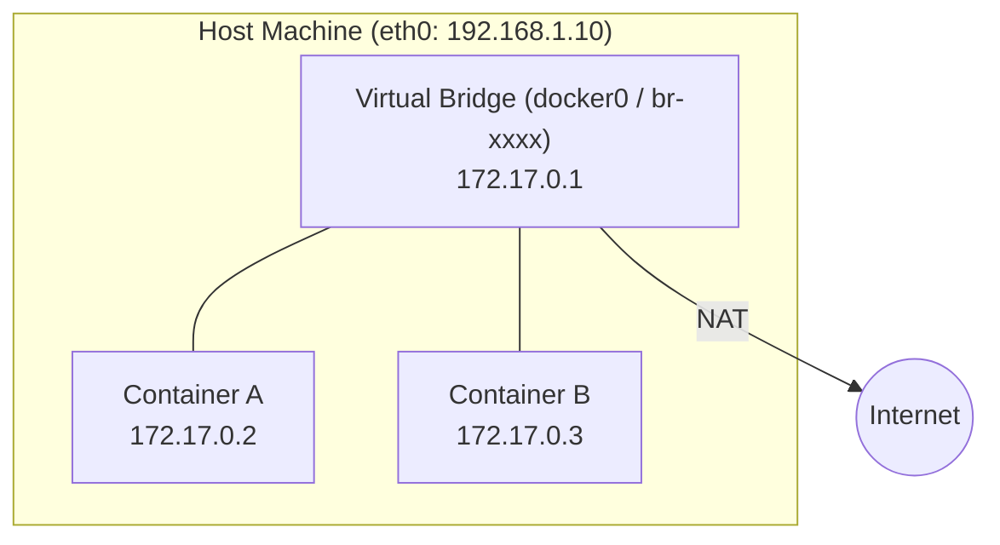
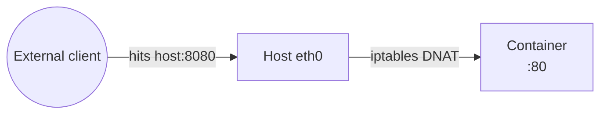
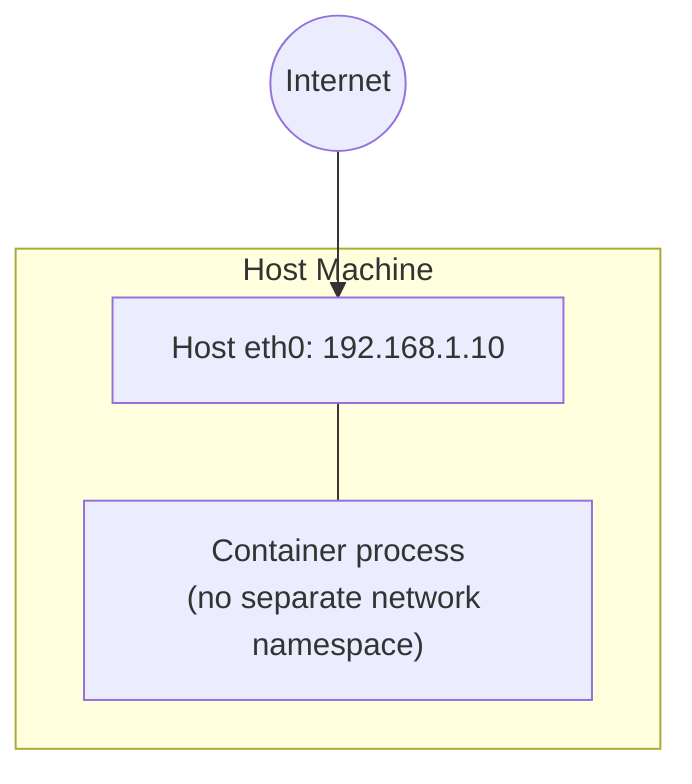
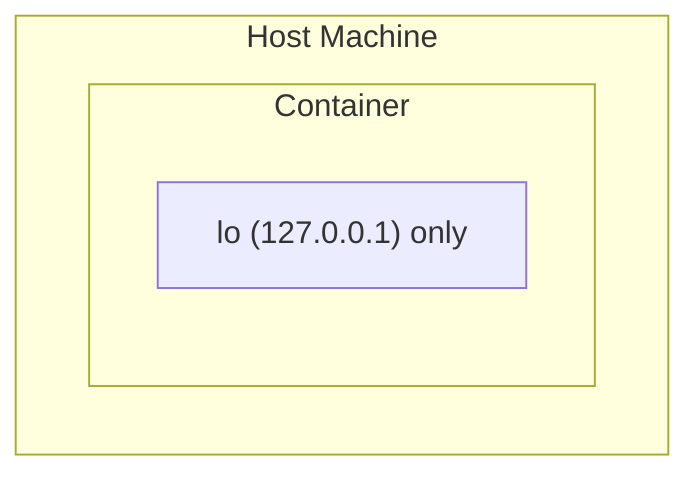
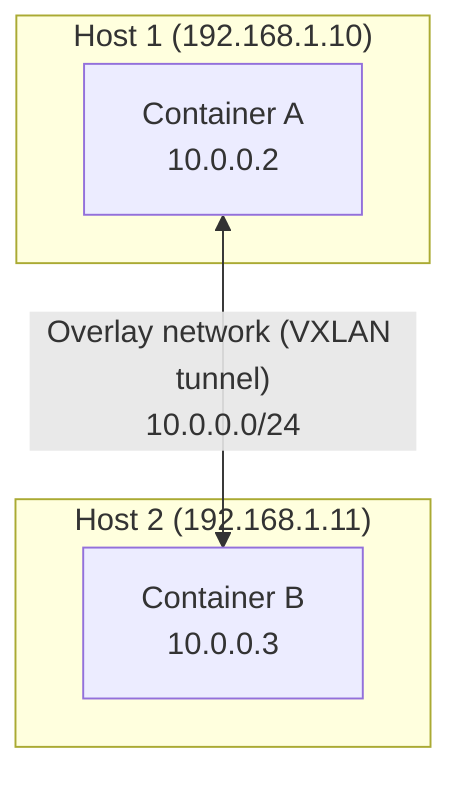
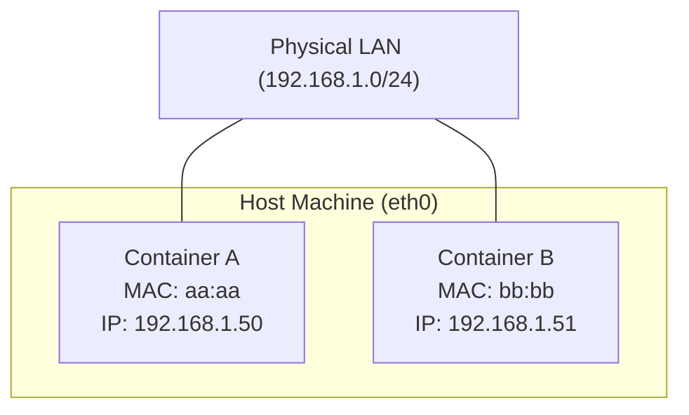
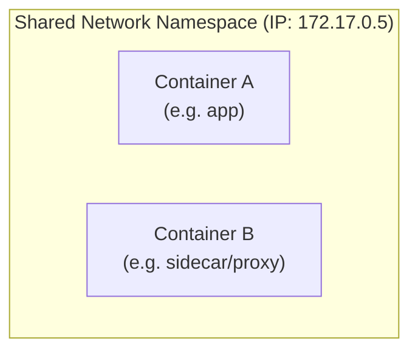

# Docker Networking

Docker gives every container a network stack, and decides how that stack connects
to other containers, the host, and the outside world via **network drivers**.

## The drivers

- **bridge** — default. Containers get a private IP on a virtual switch on the host.
- **host** — no isolation. Container shares the host's network stack directly.
- **none** — no networking at all.
- **overlay** — connects containers across multiple hosts (Swarm/multi-node).
- **macvlan** — container gets its own MAC + real LAN IP, looks like a physical device.
- **ipvlan** — like macvlan, but containers share the host's MAC (L3 split instead of L2).
- **container** — a container joins another container's network namespace and shares its IP entirely.

---

## 1. Bridge network

This is what you get automatically when you run `docker run` without `--network`.
Docker creates a virtual switch (`docker0` or a user-defined bridge) on the host.
Each container gets its own private IP on that bridge, and Docker NATs outbound
traffic through the host's real interface.

### How it actually works

1. Docker creates a Linux bridge — a virtual L2 switch — on the host (`docker0` by
   default, or a custom one per user-defined network). It's just a kernel bridge
   device, same primitive used for real switching.
2. When a container starts, Docker creates a **veth pair** — two virtual ethernet
   interfaces that act like a cable with two ends. One end goes into the container's
   own network namespace (shows up as `eth0` inside the container), the other end
   stays on the host and gets plugged into the bridge.
3. The bridge now has every container's veth-end plugged into it, so containers can
   L2-switch packets to each other directly through the bridge — this is why
   same-bridge containers can ping each other by IP with no extra config.
4. For **name-based** resolution, Docker additionally runs an embedded DNS server
   (at `127.0.0.11` inside each container) that resolves container names to their
   bridge IP. This only runs for user-defined bridges — the legacy default `docker0`
   was never wired up to it, which is the actual mechanical reason it lacks DNS.
5. For outbound traffic, the host adds an `iptables` **MASQUERADE** rule: packets
   leaving the bridge get their source IP rewritten to the host's real IP before
   going out `eth0` — that's the NAT.
6. For `-p 8080:80`, Docker adds an `iptables` **DNAT** rule: packets hitting the
   host on 8080 get their destination rewritten to the container's IP:80, then
   forwarded onto the bridge.

---

## 2. Host network

`docker run --network host`. The container skips virtual networking entirely and
shares the host's actual network namespace. If your app binds to port 80 inside
the container, it's bound to port 80 on the host — no NAT, no port mapping needed.

Tradeoff: faster (no NAT overhead), but zero network isolation — the container can
see/bind to anything the host can, and two containers can't both bind the same port.

---

## 3. None network

`docker run --network none`. The container gets a loopback interface only — no
external connectivity at all. Used for fully isolated batch jobs / security-sensitive
workloads that shouldn't be able to phone home.

---

## 4. Overlay network

Used by Docker Swarm (and conceptually similar to what Kubernetes CNI plugins do).
Connects containers running on **different physical/virtual hosts** as if they were
on the same flat network, by tunneling container traffic between hosts (VXLAN).

Key points:
- Containers address each other using the overlay's own IP range, regardless of
  which physical host they landed on.
- The overlay driver handles the tunneling between hosts transparently — from the
  container's point of view, it's just one network.
- This is what lets a Swarm service scale across multiple machines while services
  still find each other by name.

### How it actually works

Each container still connects to a local bridge on its own host, same as the
bridge driver. The trick is what happens after that: every packet leaving that
bridge for another host gets wrapped inside a **VXLAN** envelope — the original
container packet becomes the *payload* of a new UDP packet whose source/destination
are the two hosts' real IPs. That UDP packet travels over the normal physical
network like any other traffic. On arrival, the receiving host unwraps it, and the
inner packet gets delivered to the destination container's bridge as if it had
always been on the local network.

This is why it works over any existing network without special switch config —
to routers/firewalls in between, it just looks like ordinary UDP traffic between
two hosts; the "overlay" only exists once packets are unwrapped again.

---

## 5. Macvlan / ipvlan

Both let a container get a real IP on the actual LAN (not a NATed private IP) — the
container shows up on the network like any other physical device, addressable
directly by other machines on that LAN.

Difference between the two:
- **macvlan** — each container gets its own **MAC address**, split at Layer 2.
- **ipvlan** — all containers share the **host's MAC**, split at Layer 3 instead.
  Use this when your network/switch/cloud provider blocks multiple MACs per port
  (common in cloud VPCs).

Used for legacy apps that expect to be a "real" box on the network, not a NATed one.

### How it actually works

There's no bridge and no veth pair here — instead Docker creates a **sub-interface**
directly off the host's physical NIC (e.g. `eth0.10` off `eth0`) for each container,
using the kernel's macvlan/ipvlan drivers. That sub-interface is handed straight
into the container's network namespace and given a real LAN IP via DHCP or static
config.

- **macvlan** sub-interfaces are each assigned their **own MAC address**, so the
  physical switch sees multiple distinct devices on that port — the switch itself
  does the L2 forwarding, exactly like it would for separate physical machines.
- **ipvlan** sub-interfaces all keep the **host NIC's single MAC**, and the kernel
  itself does the L3 routing/splitting between them internally — the switch only
  ever sees one MAC on the wire, which is why it works on networks that block
  multiple MACs per port (common on cloud provider virtual switches).

One side effect either way: because traffic goes straight from the container's
sub-interface onto the physical network, the host itself often can't talk to the
container directly (no route back through its own NIC to the sub-interface) unless
you add extra config for it.

---

## 6. Container network mode

`docker run --network container:<name>`. Instead of getting its own network stack,
a container joins an existing container's network namespace completely — same IP,
same ports, same interfaces.

This is the exact mechanism Kubernetes Pods are built on — every container in a Pod
shares one network namespace (via a hidden "pause" container), which is why they can
reach each other over `localhost`.

### How it actually works

Every container normally gets a brand-new network namespace when it starts. This
mode skips creating one and instead calls `setns()` to attach the new process to
an **already-existing** namespace — the target container's. No new veth, no new
IP is allocated at all; the joining container is now just another process living
inside the same namespace, seeing the exact same `eth0`, IP, and open ports as the
container it joined. That's also why two containers sharing a namespace this way
can't both bind the same port — they're not two containers on a network anymore,
they're two processes sharing one network stack.

---

## Quick recall

| Driver    | Isolation | Multi-host | Typical use |
|-----------|-----------|------------|-------------|
| bridge    | Yes (default) | No | Local dev, single-host apps |
| host      | None | No | Perf-sensitive, trusted workloads |
| none      | Full | No | Fully sandboxed jobs |
| overlay   | Yes | Yes | Swarm/clustered services |
| macvlan   | Yes (own MAC+IP) | No | Legacy apps needing a real LAN identity |
| ipvlan    | Yes (own IP, shared MAC) | No | Same as macvlan, but MAC-restricted networks |
| container | Shares with target | No | Sidecars, Kubernetes Pod networking model |

